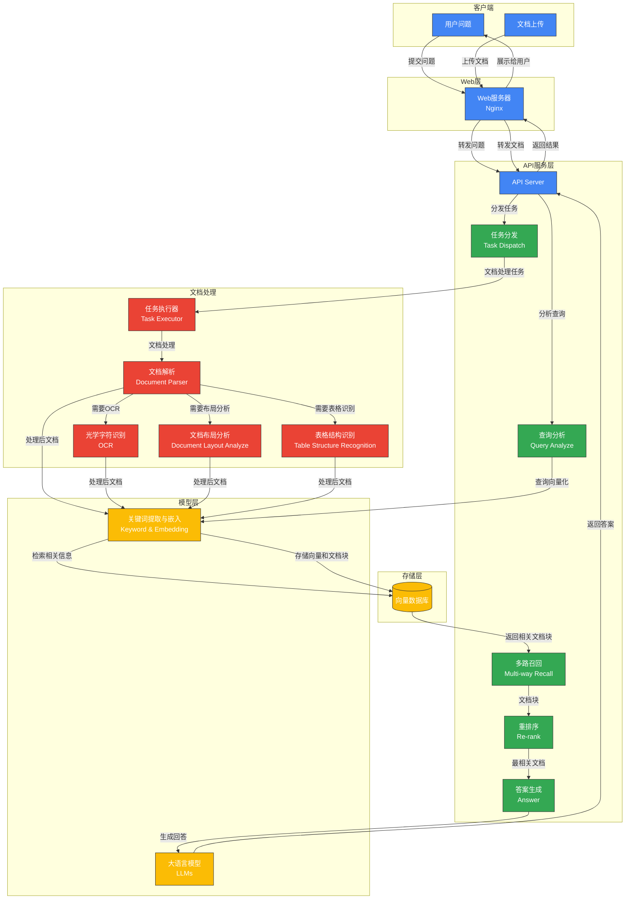

# RAGFlow 入门指南：解锁你的智能知识库引擎

你是否曾被大语言模型（LLM）的“一本正经地胡说八道”（幻觉）所困扰？你是否希望 LLM 能够基于你自己的专业文档给出可靠且有据可查的答案？那么，RAGFlow 就是你一直在寻找的答案！

RAGFlow 是一款开源的 RAG（Retrieval-Augmented Generation，检索增强生成）引擎，它的核心使命是帮助你利用深度文档理解技术，构建出高质量、高可靠性的智能知识库。无论你是大型企业还是个人开发者，RAGFlow 都能为你提供一套精简而强大的 RAG 工作流程，让你的 LLM 能够真正理解和利用各种复杂格式的数据，给出令人信服的回答并提供清晰的引用来源。

想象一下，你的知识库拥有以下超能力：

- **智能文档处理大师：** 不再担心“垃圾进垃圾出”！RAGFlow 能像一位经验丰富的学者一样，深入解析各种文档，包括 PDF、Word、PPT、Excel、图片甚至扫描件，提取出隐藏在复杂结构中的宝贵信息，确保你的输入数据是高质量的。
- **高可靠知识检索专家：** 告别“一本正经地胡说八道”！RAGFlow 采用多路召回机制和融合重排序技术，像一位资深的图书馆员一样，从海量知识中精准找到与用户问题最相关的部分，大幅减少 AI 的“幻觉”。更棒的是，它还能告诉你答案的来源，让你明明白白。
- **模型应用变形金刚：** 灵活应对各种场景需求！RAGFlow 支持多种主流 LLM 和向量模型，你可以根据自己的需求自由选择和切换。它还提供了丰富的参数配置和自定义提示工程，让你可以像一位调酒师一样，为不同的场景调制出最完美的模型应用方案。
- **企业级协作好帮手：** 从个人用到团队协作，无缝切换！RAGFlow 内置了完善的团队协作机制，支持多角色权限管理，让你的团队可以高效地共同构建和维护知识库。同时，它还提供了标准化的 API 接口，方便与你现有的企业系统集成。
- **完整 RAG 工作流管家：** 一站式解决所有问题！RAGFlow 提供从文档上传、处理到检索生成的完整自动化流程，你还可以随时进行人工干预和调整，并实时监控系统状态，就像一位贴心的管家，帮你打理好 RAG 应用的每一个环节。

## RAGFlow 核心能力和主要功能

### 1.核心能力

#### 1.1. 智能文档处理系统

**核心价值：** 解决"垃圾进垃圾出"问题，实现"质量输入，质量输出"

- **深度文档解析**：超越普通文本提取，能够识别并解析文档中的图像、表格和复杂结构

  > [!TIP]
  >
  > - 基于[深度文档理解](./deepdoc/README.md)，能够从各类复杂格式的非结构化数据中提取真知灼见。
  > - 使用 DeepDoc 解析 PDF 或其他文件的示例？参阅 **rag/app** 文件夹下的 Python 文件。

- **多格式支持**：支持丰富的文件类型，包括 Word 文档、PPT、excel 表格、txt 文件、图片、PDF、影印件、复印件、结构化数据、网页等，适应企业多样化数据

- **模板化分块策略**：采用语义感知的分块方法，保留文档结构和上下文关系

- **文本切片可视化**：多种文本模板可供选择，文本切片过程可视化，支持手动调整

#### 1.2. 高可靠知识检索框架

**核心价值：** 大幅减少AI回答中的"幻觉"问题

- **多路召回机制**：结合多种检索策略，提高知识覆盖面
- **融合重排序技术**：优化检索结果的相关性排序
- **可视化知识溯源**：提供答案的关键引用快照和原始来源链接
- **透明的检索过程**：用户可查看系统如何筛选和利用知识

#### 1.3. 灵活的模型应用架构

**核心价值：** 适应不同场景需求，提供定制化能力

- **模型灵活配置**：支持多种大语言模型和向量模型的配置和切换
- **参数化控制**：提供细粒度的模型参数调整能力
- **自定义提示工程**：支持针对特定应用场景的提示词优化
- **智能体扩展**：通过可配置的智能体实现复杂任务处理

#### 1.4. 企业级协作与集成平台

**核心价值：** 从个人应用到企业级系统的无缝扩展

- **团队协作机制**：支持多角色协作，包括管理员、编辑者和查看者权限体系
- **系统健康管理**：提供版本升级和系统诊断功能
- **API接口生态**：标准化API设计便于与企业现有系统集成
- **安全与合规**：注重数据安全和访问控制

#### 1.5. 完整RAG工作流

**核心价值：** 提供端到端的RAG应用构建体验

- **自动化处理管道**：从文档上传、处理到检索生成的完整流程
- **交互式调优**：支持人工干预和调整各环节参数
- **可视化监控**：直观展示处理状态和系统性能
- **场景适配能力**：适用于知识密集型、需要高可信度的专业领域应用

### 2. 主要功能

#### 2.1. 数据集管理

数据集是 RAG（检索增强生成）应用的基础，用于存储和管理知识库内容。

- 文件上传：支持多种格式文件上传（PDF、docx、txt等）

- 文件处理：自动进行文本提取、分块和向量化

- 文件组织：可以创建文件夹进行分类管理

- 批量操作：支持批量上传和管理文件

#### 2.2. 搜索/聊天功能

聊天是 RAG 应用的核心交互方式，让用户可以基于知识库进行问答。

- 知识库聊天：基于上传的数据集进行问答交互

- 多轮对话：支持上下文理解和多轮对话

- 实时应答：系统会实时从知识库中检索相关信息进行回答

##### AI 搜索和聊天的主要区别是什么？

- **AI 搜索**：这是使用**预定义检索策略**（加权关键词相似度和加权向量相似度的混合搜索）和系统默认聊天模型的单轮 AI 对话。它不涉及知识图谱、自动关键词或自动问题等高级 RAG 策略。**检索到的文本块将列在聊天模型响应的下方**。
- **AI 聊天**：这是多轮 AI 对话，您可以**定义检索策略**（在混合搜索中可以使用加权重排序分数替代加权向量相似度）并选择聊天模型。在 AI 聊天中，您可以为特定案例配置高级 RAG 策略，如知识图谱、自动关键词和自动问题。**检索到的文本块不会与答案一起显示。**

在调试聊天助手时，您可以使用 AI 搜索作为参考来验证模型设置和检索策略。

#### 2.3. 模型管理

模型是 RAG 系统的核心组件，负责理解用户问题和生成回答。RagFlow 支持多种模型管理功能：

- 多模型支持：支持主流大语言模型（如GPT系列、Claude系列等）

- 模型配置：可以配置模型参数如温度、最大生成长度等

- 自定义提示词：可以设定系统提示以优化模型行为

#### 2.4. 智能体管理

智能体是能够执行特定任务的自动化组件，可增强RAG系统的功能。

- 任务自动化：智能体可以执行特定任务，如信息检索、数据处理等

- 工具集成：可以集成各种工具扩展智能体能力

- 自定义行为：可以通过提示词和配置自定义智能体行为

#### 2.5. 系统管理

#### 团队成员管理

RagFlow 提供了完善的团队协作功能：

- 成员邀请：通过邮件邀请新成员加入

- 角色管理：支持管理员、编辑者、查看者三种角色

- 权限控制：基于角色的细粒度权限管理

#### 系统升级与健康检查

- 版本升级：提供自动升级和手动升级两种方式

- 健康检查：可以运行系统健康检查确保所有组件正常运行

- 问题排查：提供常见问题的排查和解决指南

## 快速上手：RAGFlow 部署初体验

想要体验 RAGFlow 的强大功能吗？最便捷的方式就是使用 Docker 镜像启动服务。

### 准备工作：

在开始之前，请确保你的系统满足以下条件：

- **CPU：** 至少 4 核
- **内存：** 至少 16 GB
- **磁盘：** 至少 50 GB
- **Docker：** 版本 >= 24.0.0
- **Docker Compose：** 版本 >= v2.26.1

### 启动你的 RAGFlow 服务：

1. **调整内核参数：** 确保 `vm.max_map_count` 不小于 262144。你可以通过命令 `sysctl vm.max_map_count` 查看当前值，如果小于该值，可以使用 `sudo sysctl -w vm.max_map_count=262144` 临时修改，并建议修改 `/etc/sysctl.conf` 文件永久生效。

2. 克隆代码仓库：

   ```Bash
   git clone https://github.com/infiniflow/ragflow.git
   cd ragflow
   ```

3. 进入 Docker 目录：

   ```Bash
   cd docker
   ```

4. 启动服务：

   - 使用 CPU：

     ```Bash
     docker compose -f docker-compose.yml up -d
     ```

   - 使用 GPU 加速（如果你的机器支持）：

     ```Bash
     docker compose -f docker-compose-gpu.yml up -d
     ```

   如果你遇到 Docker 镜像下载缓慢的问题，可以尝试修改`docker/.env`文件中的`RAGFLOW_IMAGE`变量，选择华为云或阿里云的镜像地址。

5. 检查服务状态：

    等待一段时间后，使用以下命令查看服务是否成功启动：

   ```Bash
   docker logs -f ragflow-server
   ```

   看到类似如下的欢迎信息，就说明 RAGFlow 服务已经成功运行起来了！

   ```Bash
       ____    ___     ______ ______ __
      / __ \  /   |   / ____// ____// /____  _     __
     / /_/ / / /| |  / / __ / /_   / // __ \| | /| / /
    / _, _/ / ___ | / /_/ // __/  / // /_/ /| |/ |/ /
   /_/ |_|/_/  |_|\____//_/    /_/ \____/ |__/|__/
   
    * Running on all addresses (0.0.0.0)
   ```

6. **登录 RAGFlow：** 在浏览器中输入你的服务器 IP 地址（默认端口是 80，无需输入）。

> [!TIP]
>
> 首次登录后，你可能需要系统配置中配置你想要使用的大语言模型（LLM factory）以及对应的 API Key。

在使用 RAGFlow 的过程中，遇到问题是很正常的。以下是一些常用的调试方法和技巧：

- **查看 Docker 日志：** 使用 `docker logs -f <container_name>` 命令查看相关容器的日志输出，例如 `docker logs -f ragflow-server` 可以查看后端服务的日志，帮助你了解系统运行状态和错误信息。
- **利用 Kibana 查询 Elasticsearch 数据：** 如果你选择 Elasticsearch 作为文档引擎，可以通过 Kibana (默认地址 `http://<your_server_ip>:6601`) 查看和查询向量数据，了解文档是否被正确处理和索引。登录 Kibana 的账号是 `rag_flow`，密码是 `infini_rag_flow`。

## 总结：

通过以上简单的步骤，你已经成功启动了 RAGFlow 服务，迈出了构建智能知识库的第一步。在下一篇文章中，我们将深入探讨 RAGFlow 的系统架构和调试技巧，帮助你更好地理解和使用这款强大的 RAG 引擎。敬请期待！

------

# RAGFlow 进阶：架构剖析与调试秘籍

在上篇文章中，我们一起成功启动了 RAGFlow 服务。现在，让我们更进一步，揭开 RAGFlow 的神秘面纱，深入了解其系统架构，并掌握一些常用的调试技巧，让你能够更好地驾驭这款强大的 RAG 引擎。

## RAGFlow 的核心架构：


RAGFlow 的架构设计清晰而模块化，主要可以分为以下几个层次：

- **输入层：** 这是用户与系统交互的入口，用户可以通过提问（Questions）或上传文档（Documents，支持多种格式和 Web 链接）来提供信息。Web/Nginx 作为前端服务器，负责接收这些输入。
- **API 服务层：** API Server 是整个系统的核心大脑，负责协调和管理各个组件的工作流程。它接收来自 Web 层的请求，并进行任务分发（Task Dispatch）和查询分析（Query Analyze）。
- **数据处理层：** 当用户上传文档后，RAGFlow 会将其分解成多个任务，由任务执行器（Task Executor）调用不同的文档处理模块，包括文档解析（Document Parser）、光学字符识别（OCR）、文档布局分析（Document Layout Analyze）和表格结构识别（Table Structure Recognition）。同时，系统还会进行关键词提取与嵌入（Keyword & Embedding），将文档内容转化为向量表示。
- **知识库层：** 处理后的文档向量会存储在向量数据库中（Vector Database），为后续的快速语义检索提供支持。
- **检索与生成层：** 当用户提问时，系统会通过多路召回（Multi-way Recall）机制从向量数据库中检索相关的文档片段（Chunk），然后利用重排序（Re-rank）技术选择最相关的片段。最后，大型语言模型（LLMs）会结合用户的问题和检索到的文档片段生成最终的答案（Answer）。
- **输出层：** 系统将生成的答案返回给用户。

### 数据流向概览：



- **问题处理流程：** 用户提问 -> Web 服务器 -> API 服务器 -> 查询分析 -> 向量化 -> 向量数据库检索 -> 多路召回 -> 重排序 -> 答案生成 -> 返回给用户。
- **文档处理流程：** 用户上传文档 -> Web 服务器 -> API 服务器 -> 任务分发 -> 任务执行器 -> 文档解析/OCR/布局分析/表格识别 -> 向量化 -> 存储到向量数据库。

### 关键环节解析：

- **多路召回机制：** RAGFlow 不仅仅依赖于单一的检索方法，而是结合了多种策略（如关键词匹配、语义相似度等），从而更全面地覆盖相关知识。
- **重排序过程：** 对召回的文档片段进行精细化排序，确保返回最相关的结果，提高答案的质量。
- **向量化与存储：** 将文档转化为向量表示并存储在专门的向量数据库中，是实现高效语义检索的关键。
- **任务调度与执行：** 灵活的任务调度机制能够根据不同文档的类型和需求，调用相应的处理模块。
- **文档处理多样性：** RAGFlow 支持处理多种复杂的文档格式，这得益于其强大的文档解析和识别能力。

**RAGFlow 项目结构导览（核心业务模块）：**

RAGFlow 的代码结构组织清晰，以下是一些核心业务模块的简要介绍：

- **`rag/`：RAG 模块** - 包含检索增强生成的核心实现，如文档处理 (`app/`)、LLM 集成 (`llm/`)、自然语言处理 (`nlp/`)、服务层 (`svr/`) 等。
- **`api/`：API 服务模块** - 提供连接前端与后端核心功能的 RESTful 接口。
- **`deepdoc/`：文档智能处理模块** - 负责从各种文档中提取结构化信息，包括文档解析和计算机视觉处理（OCR、布局分析、图表识别）。
- **`graphrag/`：图形化 RAG 模块** - 将传统 RAG 与图结构结合，支持更复杂的知识推理。
- **`agent/`：智能代理模块** - 将 RAG 能力与工具调用、工作流编排结合，实现更复杂的自动化任务。
- **`web/`：前端模块** - 基于 React + TypeScript 开发，提供用户界面。

## RAGFlow 调试秘籍：

> RAGFlow 调试，一般是面向需要二次开发和查看代码流程，因此需要使用源码启动方式
>
> 对于希望深入 RAGFlow 代码进行二次开发和流程查看的开发者来说，掌握源码启动下的调试技巧至关重要。利用 VSCode 的远程调试功能，你可以像在本地开发一样方便地设置断点、单步执行、查看变量，从而更高效地理解代码逻辑和排查问题。

### 启动后端

1. 安装 uv。如已经安装，可跳过本步骤：

   ```bash
   pip install pipx
   pipx install uv
   export UV_INDEX=https://mirrors.aliyun.com/pypi/simple
   ```

   > - **`pip` 用于安装 Python 库，这些库是构建其他 Python 项目的基础。** 你通常会在项目特定的虚拟环境中使用 `pip`。
   > - **`pipx` 用于安装 Python 应用程序，这些应用程序是你可以直接在命令行运行的独立工具。** `pipx` 会确保每个应用程序都在其自己的隔离环境中运行。

   ```bash
   # uv命令生效
   pipx ensurepath
   ```

2. 下载源代码并安装 Python 依赖：

   ```bash
   git clone https://github.com/infiniflow/ragflow.git
   cd ragflow/
   uv sync --python 3.10 --all-extras # install RAGFlow dependent python modules
   ```

3. 通过 Docker Compose 启动依赖的服务（MinIO, Elasticsearch, Redis, and MySQL）：

   ```bash
   docker-compose -f docker/docker-compose-base.yml up -d --force-recreate
   ```

   在 `/etc/hosts` 中添加以下代码，将 **conf/service_conf.yaml** 文件中的所有 host 地址都解析为 `127.0.0.1`：

   ```
   127.0.0.1       es01 infinity mysql minio redis
   ```

4. 如果无法访问 HuggingFace，可以把环境变量 `HF_ENDPOINT` 设成相应的镜像站点：

   ```bash
   export HF_ENDPOINT=https://hf-mirror.com
   ```

5. 启动后端服务：

   ```bash
   source .venv/bin/activate
   export PYTHONPATH=$(pwd)
   bash /root/ragflow/docker/launch_backend_service.sh
   ```

   正常启动，出现以下信息表示启动成功：

   ```bash
           ____   ___    ______ ______ __               
          / __ \ /   |  / ____// ____// /____  _      __
         / /_/ // /| | / / __ / /_   / // __ \| | /| / /
        / _, _// ___ |/ /_/ // __/  / // /_/ /| |/ |/ / 
       /_/ |_|/_/  |_|\____//_/    /_/ \____/ |__/|__/                             
   
       
   2025-04-11 11:19:01,094 INFO     27812 RAGFlow version: v0.17.2-204-g1979222b full
   2025-04-11 11:19:01,095 INFO     27812 project base: /root/ragflow
   2025-04-11 11:19:01,096 INFO     27812 Current configs, from /root/ragflow/conf/service_conf.yaml:
   	ragflow: {'host': '0.0.0.0', 'http_port': 9380}
   	mysql: {'name': 'rag_flow', 'user': 'root', 'password': '********', 'host': 'localhost', 'port': 5455, 'max_connections': 100, 'stale_timeout': 30}
   	minio: {'user': 'rag_flow', 'password': '********', 'host': 'localhost:9000'}
   	es: {'hosts': 'http://localhost:1200', 'username': 'elastic', 'password': '********'}
   	infinity: {'uri': 'localhost:23817', 'db_name': 'default_db'}
   	redis: {'db': 1, 'password': '********', 'host': 'localhost:6379'}
   2025-04-11 11:19:01,100 INFO     27812 Use Elasticsearch http://localhost:1200 as the doc engine.
   2025-04-11 11:19:01,126 INFO     27812 GET http://localhost:1200/ [status:200 duration:0.023s]
   2025-04-11 11:19:01,134 INFO     27812 HEAD http://localhost:1200/ [status:200 duration:0.007s]
   2025-04-11 11:19:01,136 INFO     27812 Elasticsearch http://localhost:1200 is healthy.
   2025-04-11 11:19:01,143 WARNING  27812 Load term.freq FAIL!
   2025-04-11 11:19:01,151 WARNING  27812 Realtime synonym is disabled, since no redis connection.
   2025-04-11 11:19:01,159 WARNING  27812 Load term.freq FAIL!
   2025-04-11 11:19:01,165 WARNING  27812 Realtime synonym is disabled, since no redis connection.
   2025-04-11 11:19:01,167 INFO     27812 MAX_CONTENT_LENGTH: 134217728
   2025-04-11 11:19:01,168 INFO     27812 MAX_FILE_COUNT_PER_USER: 0
   2025-04-11 11:19:04,280 INFO     27812 init web data success:2.7721996307373047
   2025-04-11 11:19:04,284 INFO     27812 update_progress lock_value: 58f01bdd-c3ab-4844-85fa-28bcd3ee09e0
   2025-04-11 11:19:04,284 INFO     27812 RAGFlow HTTP server start...
   2025-04-11 11:19:04,288 INFO     27812 WARNING: This is a development server. Do not use it in a production deployment. Use a production WSGI server instead.
    * Running on all addresses (0.0.0.0)
    * Running on http://127.0.0.1:9380
    * Running on http://192.168.172.128:9380
   ```

> 其中：
>
> - `v0.17.2`：官方发布的版本。
> - `204`：自官方发布以来的 git 提交次数。
> - `g1979222b`：`g` 是前缀，`1979222b` 是当前提交 ID 的前七个字符。
> - `full`/`slim`：RAGFlow 的版本。
>   - `full`：完整的 RAGFlow 版本。
>   - `slim`：不包含嵌入模型和 Python 包的 RAGFlow 版本。

### 启动前端

6. 安装前端依赖：

   ```bash
   cd web
   apt install npm
   npm install
   ```

7. 启动前端服务：

   ```bash
   cd /root/ragflow/web
   npm run dev
   ```

   以下界面说明系统已经成功启动：

   ```bash
   Done in 1874ms.
   info  - MFSU eager strategy enabled
   info  - [MFSU][eager] restored cache
   [HPM] Proxy created: /api,/v1  -> http://127.0.0.1:9380/
   event - [MFSU][eager] start build deps
   info  - [MFSU] skip buildDeps
           ╔════════════════════════════════════════════════════╗
           ║ App listening at:                                  ║
           ║  >   Local: http://localhost:9222                  ║
   ready - ║  > Network: http://192.168.172.128:9222            ║
           ║                                                    ║
           ║ Now you can open browser with the above addresses↑ ║
           ╚════════════════════════════════════════════════════╝
   info  - [MFSU][eager] worker init, takes 2243ms
   ```

### 组件访问

根据 `docker/.env` 文件的配置，以下是各个组件的详细访问信息：

#### 1. ElasticSearch

- 访问地址：`http://192.168.172.128:1200`
- 账号：elastic
- 密码：infini_rag_flow

#### 2. Kibana

- 访问地址：`http://192.168.172.128:6601`
- 账号：rag_flow
- 密码：infini_rag_flow

##### 使用 Kibana 查询和可视化 Elasticsearch 中的向量数据

根据配置文件，我可以看到：

- Kibana 运行在 6601 端口 (KIBANA_PORT=6601)
- Elasticsearch 运行在 1200 端口 (ES_PORT=1200)
- 登录凭证：
  - 用户名：rag_flow (KIBANA_USER)
  - 密码：infini_rag_flow (KIBANA_PASSWORD)

让我为你详细说明如何使用 Kibana 查询向量数据：

1. **访问 Kibana**

   - 打开浏览器，访问 `http://localhost:6601`
   - 使用以下凭证登录：
     - 用户名：rag_flow
     - 密码：infini_rag_flow

2. **查看向量数据**
   在 Kibana 中查询向量数据的步骤：

   a. **使用 Dev Tools**

   - 点击左侧菜单栏的 "Dev Tools"（开发工具）
   - 在 Console 中可以直接执行 Elasticsearch 查询

   b. **查看索引数据**

   ```bash
   # 查看所有索引
   GET _cat/indices?v
   # 查找ragflow_开头
   # 如：ragflow_e24416a9106d11f0a4a9c73ddb33c1ac
   
   # 查看向量索引的映射结构
   GET your_index_name/_mapping
   
   GET ragflow_e24416a9106d11f0a4a9c73ddb33c1ac/_mapping
   ```

   c. **查询向量数据**

   ```json
   # 基本查询示例
   GET your_index_name/_search
   {
     "query": {
       "match_all": {}
     }
   }
   
   # 向量相似度查询示例
   GET ragflow_e24416a9106d11f0a4a9c73ddb33c1ac/_search
   {
     "query": {
       "script_score": {
         "query": {
           "match_all": {}
         },
         "script": {
           "source": "cosineSimilarity(params.query_vector, 'vector_field') + 1.0",
           "params": {
             "query_vector": [0.024323905304040452] // 你的查询向量
           }
         }
       }
     }
   }
   ```

**注意事项：**

1. 向量数据通常是高维数据，直接可视化可能不太直观。建议先进行降维处理（如 PCA、t-SNE）后再可视化。
2. 在进行向量相似度搜索时，确保使用正确的相似度计算方法（cosine similarity、euclidean distance 等）。
3. 对于大规模向量数据，建议使用适当的分页和限制来优化查询性能。

#### 3. Infinity（向量数据库，可选）

- Thrift 端口：23817
- HTTP 端口：23820
- PostgreSQL 端口：5432
- 主机名：infinity

#### 4. MySQL

- 访问端口：`5455`
- 数据库名：rag_flow
- 密码：infini_rag_flow

#### 5. MinIO（对象存储）

- API 访问地址：`http://192.168.172.128:9000`
- 控制台地址：`http://192.168.172.128:9001`
- 用户名：rag_flow
- 密码：infini_rag_flow

#### 6. Redis

- 访问地址：`redis:6379`
- 密码：infini_rag_flow

#### 7. HuggingFace

- **模型保存地址:**

  **Linux:** `~/.cache/huggingface/`

  **macOS:** `~/Library/Caches/huggingface/`

  **Windows:** `C:\Users\<YourUsername>\.cache\huggingface\`

- **代理地址：**`HF_ENDPOINT=https://hf-mirror.com`

#### 8. RAGFlow API服务

- API 地址：`http://192.168.172.128:9380`
- API 文档：`docs/references/http_api_reference_zh.md`

### 后端调试

> [!TIP]
>
> 我们需要配置 VSCode 通过 SSH 连接到远程服务器，并设置 Python 调试器。
>
> 1. 开发环境：Windows 11
> 2. 部署环境：Ubuntu22.04，代码在`/root/ragflow`目录

#### 1. 在 Windows 上的 VSCode(或Cursor) 配置

1. 安装必要的 VSCode 扩展：
   - Remote - SSH
   - Python
   - Python Debug

2. 配置 SSH 连接：
   - 按 `Ctrl+Shift+P`
   - 输入 `Remote-SSH: Connect to Host`
   - 添加新的 SSH 主机：`root@192.168.172.128`
   - 选择 SSH 配置文件位置（通常在 `C:\Users\YourUsername\.ssh\config`）
   - 输入密码 `fly123`

#### 2. 配置调试设置

让我们在Ubuntu环境的`/root/ragflow/.vscode/launch.json`创建调试配置文件：

```json with comments:.vscode/launch.json
{
    "version": "0.2.0",
    "configurations": [
        {
            "name": "Backend",
            "type": "python",
            "request": "launch",
            "program": "${workspaceFolder}/api/ragflow_server.py",
            "console": "integratedTerminal",
            "justMyCode": false,
            "env": {
                "PYTHONPATH": "${workspaceFolder}"
            }
        }
    ]
} 
```

#### 3. 安装调试所需的包

让我们确保远程环境安装了调试所需的包：

```bash
pip install debugpy
```

#### 4. 使用方法

现在你可以按照以下步骤进行远程调试：

1. 在 VSCode 中连接到远程服务器：

   - 点击左下角的绿色图标
   - 选择 "Connect to Host..."
   - 选择 `root@192.168.172.128`

2. 打开项目文件夹：

   - 在 VSCode 中，选择 "File > Open Folder"
   - 输入 `/root/ragflow`

3. 设置断点：

   - 打开你想调试的 Python 文件
   - 点击行号左侧设置断点

4. 启动调试：

   - 按 `F5` 或点击 "Run and Debug" 图标
   - 选择相应的调试配置：
     - "Python: RAGFlow Backend" 用于调试主服务器
     - "Python: Task Executor" 用于调试任务执行器

5. 调试控制：

   - F5: 继续执行
   - F10: 单步执行（不进入函数）
   - F11: 单步执行（进入函数）
   - Shift+F5: 停止调试
   - F9: 切换断点

   

#### 注意事项：

1. 调试时会暂停原有的服务，建议在开发环境进行调试。

2. 如果需要同时调试多个任务执行器，可以复制 "Python: Task Executor" 配置，修改 `args` 中的任务 ID。

3. 调试时可以在 DEBUG CONSOLE 中查看变量值，也可以在 WATCH 窗口添加要监视的变量。

4. 如果遇到连接问题，可以检查：
   - 防火墙设置
   - SSH 连接是否正常
   - debugpy 是否正确安装

## 结语：

理解 RAGFlow 的架构和掌握调试技巧是成为一名熟练的 RAGFlow 使用者和开发者的关键。希望本文能帮助你更深入地了解 RAGFlow 的内部运作机制，并在遇到问题时能够快速定位和解决。继续探索 RAGFlow 的更多功能和可能性，打造属于你自己的智能知识库吧！

