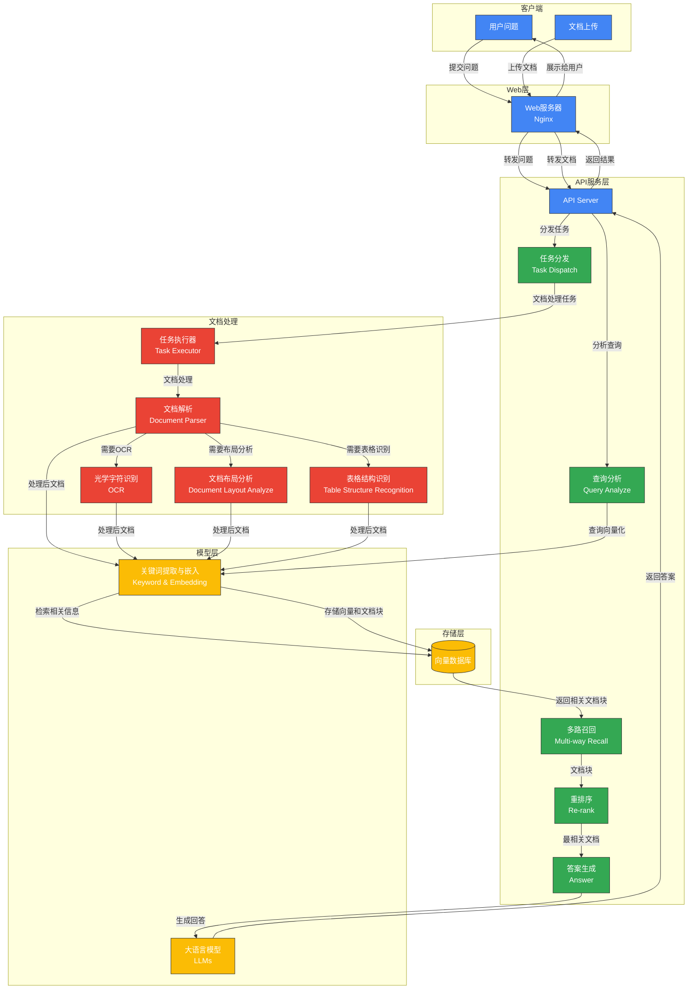

#  RAGFlow入门

[RAGFlow](https://ragflow.io/) 是一款基于深度文档理解构建的开源 RAG（Retrieval-Augmented Generation）引擎。RAGFlow 可以为各种规模的企业及个人提供一套精简的 RAG 工作流程，结合大语言模型（LLM）针对用户各类不同的复杂格式数据提供可靠的问答以及有理有据的引用。

## 1.核心能力

### 1.1. 智能文档处理系统

**核心价值：** 解决"垃圾进垃圾出"问题，实现"质量输入，质量输出"

- **深度文档解析**：超越普通文本提取，能够识别并解析文档中的图像、表格和复杂结构

  > [!TIP]
  >
  > - 基于[深度文档理解](./deepdoc/README.md)，能够从各类复杂格式的非结构化数据中提取真知灼见。
  > - 使用 DeepDoc 解析 PDF 或其他文件的示例？参阅 **rag/app** 文件夹下的 Python 文件。

- **多格式支持**：支持丰富的文件类型，包括 Word 文档、PPT、excel 表格、txt 文件、图片、PDF、影印件、复印件、结构化数据、网页等，适应企业多样化数据

- **模板化分块策略**：采用语义感知的分块方法，保留文档结构和上下文关系

- **文本切片可视化**：多种文本模板可供选择，文本切片过程可视化，支持手动调整

### 1.2. 高可靠知识检索框架

**核心价值：** 大幅减少AI回答中的"幻觉"问题

- **多路召回机制**：结合多种检索策略，提高知识覆盖面
- **融合重排序技术**：优化检索结果的相关性排序
- **可视化知识溯源**：提供答案的关键引用快照和原始来源链接
- **透明的检索过程**：用户可查看系统如何筛选和利用知识

### 1.3. 灵活的模型应用架构

**核心价值：** 适应不同场景需求，提供定制化能力

- **模型灵活配置**：支持多种大语言模型和向量模型的配置和切换
- **参数化控制**：提供细粒度的模型参数调整能力
- **自定义提示工程**：支持针对特定应用场景的提示词优化
- **智能体扩展**：通过可配置的智能体实现复杂任务处理

### 1.4. 企业级协作与集成平台

**核心价值：** 从个人应用到企业级系统的无缝扩展

- **团队协作机制**：支持多角色协作，包括管理员、编辑者和查看者权限体系
- **系统健康管理**：提供版本升级和系统诊断功能
- **API接口生态**：标准化API设计便于与企业现有系统集成
- **安全与合规**：注重数据安全和访问控制

### 1.5. 完整RAG工作流

**核心价值：** 提供端到端的RAG应用构建体验

- **自动化处理管道**：从文档上传、处理到检索生成的完整流程
- **交互式调优**：支持人工干预和调整各环节参数
- **可视化监控**：直观展示处理状态和系统性能
- **场景适配能力**：适用于知识密集型、需要高可信度的专业领域应用

## 2. 主要功能

### 2.1. 数据集管理

数据集是 RAG（检索增强生成）应用的基础，用于存储和管理知识库内容。

- 文件上传：支持多种格式文件上传（PDF、docx、txt等）

- 文件处理：自动进行文本提取、分块和向量化

- 文件组织：可以创建文件夹进行分类管理

- 批量操作：支持批量上传和管理文件

### 2.2. 搜索/聊天功能

聊天是 RAG 应用的核心交互方式，让用户可以基于知识库进行问答。

- 知识库聊天：基于上传的数据集进行问答交互

- 多轮对话：支持上下文理解和多轮对话

- 实时应答：系统会实时从知识库中检索相关信息进行回答

#### AI 搜索和聊天的主要区别是什么？

- **AI 搜索**：这是使用**预定义检索策略**（加权关键词相似度和加权向量相似度的混合搜索）和系统默认聊天模型的单轮 AI 对话。它不涉及知识图谱、自动关键词或自动问题等高级 RAG 策略。**检索到的文本块将列在聊天模型响应的下方**。
- **AI 聊天**：这是多轮 AI 对话，您可以**定义检索策略**（在混合搜索中可以使用加权重排序分数替代加权向量相似度）并选择聊天模型。在 AI 聊天中，您可以为特定案例配置高级 RAG 策略，如知识图谱、自动关键词和自动问题。**检索到的文本块不会与答案一起显示。**

在调试聊天助手时，您可以使用 AI 搜索作为参考来验证模型设置和检索策略。

### 2.3. 模型管理

模型是 RAG 系统的核心组件，负责理解用户问题和生成回答。RagFlow 支持多种模型管理功能：

- 多模型支持：支持主流大语言模型（如GPT系列、Claude系列等）

- 模型配置：可以配置模型参数如温度、最大生成长度等

- 自定义提示词：可以设定系统提示以优化模型行为

#### 支持更多模型

##### 如何使用本地部署的 LLM 运行 RAGFlow？

您可以使用 Ollama 或 Xinference 来部署本地 LLM。请参阅`docs/guides/models/deploy_local_llm.mdx`了解更多信息。

------

##### 如何添加不支持的 LLM？

如果您的模型目前不受支持但具有与 OpenAI 兼容的 API，请在**模型提供商**页面上点击 **OpenAI-API-Compatible** 来配置您的模型：


------

##### 如何将 RAGFlow 与 Ollama 互联？

- 如果 RAGFlow 是本地部署的，请确保您的 RAGFlow 和 Ollama 在同一局域网中。
- 如果您使用我们的在线演示，请确保您的 Ollama 服务器的 IP 地址是公开且可访问的。

请参阅`docs/guides/models/deploy_local_llm.mdx`了解更多信息。

### 2.4. 智能体管理

智能体是能够执行特定任务的自动化组件，可增强RAG系统的功能。

- 任务自动化：智能体可以执行特定任务，如信息检索、数据处理等

- 工具集成：可以集成各种工具扩展智能体能力

- 自定义行为：可以通过提示词和配置自定义智能体行为

### 2.5. 系统管理

#### 团队成员管理

RagFlow 提供了完善的团队协作功能：

- 成员邀请：通过邮件邀请新成员加入

- 角色管理：支持管理员、编辑者、查看者三种角色

- 权限控制：基于角色的细粒度权限管理

#### 系统升级与健康检查

根据 upgrade_ragflow.mdx 和 run_health_check.md 文档：

- 版本升级：提供自动升级和手动升级两种方式

- 健康检查：可以运行系统健康检查确保所有组件正常运行

- 问题排查：提供常见问题的排查和解决指南

## 3.以Docker镜像启动服务

### 前提条件

- 操作系统：Ubuntu22.04
- CPU >= 4 核
- RAM >= 16 GB
- Disk >= 50 GB
- Docker >= 24.0.0 & Docker Compose >= v2.26.1

### 启动服务器

1. 确保 `vm.max_map_count` 不小于 262144：

   > [!TIP]
   >
   > **`max_map_count`**:  这是一个内核参数，用于限制一个进程可以拥有的 **内存映射区域 (memory map areas)** 的最大数量。
   >
   > **什么是内存映射区域？**
   >
   > 内存映射是一种将文件或设备的内容直接映射到进程的虚拟地址空间的技术。这使得进程可以像访问内存一样访问文件或设备的内容，而无需进行显式的读写操作。

    如需确认 `vm.max_map_count` 的大小：

    ```bash
    $ sysctl vm.max_map_count
    ```

    如果 `vm.max_map_count` 的值小于 262144，可以进行重置：

    ```bash
    # 这里我们设为 262144:
    $ sudo sysctl -w vm.max_map_count=262144
    ```

    你的改动会在下次系统重启时被重置。如果希望做永久改动，还需要在 **/etc/sysctl.conf** 文件里把 `vm.max_map_count` 的值再相应更新一遍：

    ```bash
    vm.max_map_count=262144
    ```

2. 克隆仓库：

   ```bash
   # 官方代码
   $ git clone https://github.com/infiniflow/ragflow.git
   # Fork官方1.17.2de
   $ git clone -b fly https://github.com/AlexFly666/ragflow.git
   ```

3. 进入 **docker** 文件夹，利用提前编译好的 Docker 镜像启动服务器：

   > [!TIP]
   >
   > 运行以下命令会自动下载 RAGFlow slim Docker 镜像 `v0.17.2-slim`。
   >
   > 请参考下表查看不同 Docker 发行版的描述。如需下载不同于 `v0.17.2-slim` 的 Docker 镜像，请在运行 `docker compose` 启动服务之前先更新 **docker/.env** 文件内的 `RAGFLOW_IMAGE` 变量。
   >
   > 比如，你可以通过设置 `RAGFLOW_IMAGE=infiniflow/ragflow:v0.17.2` 来下载 RAGFlow 镜像的 `v0.17.2` 完整发行版。

   ```bash
   $ cd ragflow/docker
   # Use CPU for embedding and DeepDoc tasks:
   $ docker compose -f docker-compose.yml up -d
   
   # To use GPU to accelerate embedding and DeepDoc tasks:
   # docker compose -f docker-compose-gpu.yml up -d
   ```

   | RAGFlow image tag | Image size (GB) | Has embedding models? | Stable?                  |
   | ----------------- | --------------- | --------------------- | ------------------------ |
   | v0.17.2           | &approx;9       | :heavy_check_mark:    | Stable release           |
   | v0.17.2-slim      | &approx;2       | ❌                    | Stable release           |
   | nightly           | &approx;9       | :heavy_check_mark:    | _Unstable_ nightly build |
   | nightly-slim      | &approx;2       | ❌                     | _Unstable_ nightly build |

   > [!TIP]
   > 如果你遇到 Docker 镜像拉不下来的问题，可以在 **docker/.env** 文件内根据变量 `RAGFLOW_IMAGE` 的注释提示选择华为云或者阿里云的相应镜像。
   >
   > - 华为云镜像名：`swr.cn-north-4.myhuaweicloud.com/infiniflow/ragflow`
   > - 阿里云镜像名：`registry.cn-hangzhou.aliyuncs.com/infiniflow/ragflow`

4. 服务器启动成功后再次确认服务器状态：

   ```bash
   $ docker logs -f ragflow-server
   ```

   _出现以下界面提示说明服务器启动成功：_

   ```bash
        ____   ___    ______ ______ __
       / __ \ /   |  / ____// ____// /____  _      __
      / /_/ // /| | / / __ / /_   / // __ \| | /| / /
     / _, _// ___ |/ /_/ // __/  / // /_/ /| |/ |/ /
    /_/ |_|/_/  |_|\____//_/    /_/ \____/ |__/|__/
   
    * Running on all addresses (0.0.0.0)
   ```

   > 如果您在没有看到上面的提示信息出来之前，就尝试登录 RAGFlow，你的浏览器有可能会提示 `network anormal` 或 `网络异常`。

5. 在你的浏览器中输入你的服务器对应的 IP 地址并登录 RAGFlow。
   > 上面这个例子中，您只需输入 http://IP_OF_YOUR_MACHINE 即可：未改动过配置则无需输入端口（默认的 HTTP 服务端口 80）。

6. 在 [service_conf.yaml.template](./docker/service_conf.yaml.template) 文件的 `user_default_llm` 栏配置 LLM factory，并在 `API_KEY` 栏填写和你选择的大模型相对应的 API key。

   > [!TIP]
   >
   > 模型设置详见 [模型设置文档](https://ragflow.io/docs/dev/llm_api_key_setup)。


## 4. 系统配置

系统配置涉及以下三份文件：

1. [./docker/.env](./docker/.env)：存放一些基本的系统环境变量，比如 `SVR_HTTP_PORT`、`MYSQL_PASSWORD`、`MINIO_PASSWORD` 等。
2. [service_conf.yaml.template](./docker/service_conf.yaml.template)：配置各类后台服务。
3. [docker-compose.yml](./docker/docker-compose.yml): 系统依赖该文件完成启动。

请务必确保 [./docker/.env](./docker/.env) 文件中的变量设置与 [service_conf.yaml.template](./docker/service_conf.yaml.template) 文件中的配置保持一致！

如果不能访问镜像站点 hub.docker.com 或者模型站点 huggingface.co，请按照 [./docker/.env](./docker/.env) 注释修改 `RAGFLOW_IMAGE` 和 `HF_ENDPOINT`。

> [!TIP]
>
> [[./docker/README](./docker/README.md) 解释了 [service_conf.yaml.template](./docker/service_conf.yaml.template) 用到的环境变量设置和服务配置。

如需更新默认的 HTTP 服务端口(80), 可以在 [docker-compose.yml](./docker/docker-compose.yml) 文件中将配置 `80:80` 改为 `<YOUR_SERVING_PORT>:80`。

> 所有系统配置都需要通过系统重启生效：
>
> ```bash
> $ docker compose -f docker-compose.yml up -d
> ```

## 5. 系统架构


基于提供的RAGFlow架构图，其主要架构和功能可以总结如下：

**主要架构：**

1. 输入层：
   - **Questions:** 用户可以直接输入问题。
   - **Documents:** 用户可以上传文件（File）或提供Web链接（Web）作为知识来源。
2. **Web/Nginx:** 作为系统的前端入口，接收用户的问题和文档输入。
3. **API Server:** 系统的核心控制中心，负责协调和管理各个组件的工作流程。
4. 数据处理层：
   - **Query Analyze:** 对用户输入的问题进行分析和理解。
   - **Task Dispatch:** 将上传的文档分解成多个任务进行处理。
   - **Document Parser:** 解析各种文档格式的内容。
   - **OCR (Optical Character Recognition):** 对文档中的图片进行文字识别。
   - **Task Executor:** 执行文档处理任务。
   - **Document Layout Analyze:** 分析文档的布局和结构。
   - **Table Structure Recognition:** 识别和提取文档中的表格结构和数据。
   - **Keyword & Embedding:** 从处理后的文档内容中提取关键词并生成向量嵌入（Embedding）。
5. 知识库层：
   - **Vector Database:** 存储文档的向量嵌入，用于高效的语义检索。
6. 检索与生成层：
   - **Multi-way Recall:** 根据用户的问题，从向量数据库中检索相关的文档片段（Chunk）。
   - **Re-rank:** 对检索到的文档片段进行重新排序，选择最相关的片段。
   - **LLMs (Large Language Models):** 利用大型语言模型，结合用户的问题和检索到的相关文档片段生成最终的答案（Answer）。
7. 输出层：
   - **Answer:** 将生成的答案返回给用户。

**主要功能：**

1. **问答系统：** 能够接收用户提出的问题，并基于提供的知识库（文档）生成答案。
2. **文档处理：** 支持多种格式的文档上传和处理，包括解析、OCR、布局分析和表格识别等。
3. **知识存储与检索：** 将处理后的文档内容转化为向量嵌入并存储在向量数据库中，实现高效的语义检索。
4. **多路召回与重排序：** 采用多路召回策略检索相关文档片段，并通过重排序选择最相关的结果。
5. **利用大型语言模型生成答案：** 集成大型语言模型，利用检索到的知识生成自然、准确的答案。

总而言之，RAGFlow架构是一个典型的检索增强生成（Retrieval-Augmented Generation）系统，它通过处理和存储文档，然后在回答问题时检索相关信息，并结合大型语言模型生成最终答案。

### 系统组件说明



#### 1. 客户端层

- **用户问题(Questions)**: 用户输入的查询或问题
- **文档(Documents)**: 用户上传的文档，可能包含各种格式(PDF、Word、图片等)

#### 2. Web层

- **Web服务器(Nginx)**: 处理用户请求，负责静态资源分发和请求转发

#### 3. API服务层

- **API Server**: 系统核心，协调各组件工作
- **任务分发(Task Dispatch)**: 将文档处理任务分配给相应的处理模块
- **查询分析(Query Analyze)**: 分析用户查询意图和结构
- **多路召回(Multi-way Recall)**: 从多个维度和方法检索相关信息
- **重排序(Re-rank)**: 对召回的结果进行排序，提高相关性
- **答案生成(Answer)**: 根据检索结果生成最终答案

#### 4. 存储层

- **向量数据库**: 存储文档的向量表示和原文块，支持高效相似度检索

#### 5. 模型层

- **大语言模型(LLMs)**: 用于生成自然语言回答
- **关键词提取与嵌入(Keyword & Embedding)**: 提取文本关键词并生成向量表示

#### 6. 文档处理层

- **文档解析(Document Parser)**: 解析各种格式的文档
- **OCR**: 从图像中提取文本
- **文档布局分析(Document Layout Analyze)**: 理解文档结构
- **表格结构识别(Table Structure Recognition)**: 识别和解析表格
- **任务执行器(Task Executor)**: 执行各种文档处理任务

### 数据流向说明

#### 问题处理流程

1. 用户提交问题
2. Web服务器接收请求并转发到API服务器
3. API服务器调用查询分析模块分析问题
4. 问题经过向量化处理
5. 系统从向量数据库中检索相关文档块
6. 通过多路召回获取候选答案材料
7. 重排序模块对材料进行排序
8. 答案生成模块结合LLM生成最终答案
9. 答案返回给用户

#### 文档处理流程

1. 用户上传文档
2. 文档通过Web服务器转发到API服务器
3. API服务器将文档交给任务分发模块
4. 任务分发模块将处理任务分配给任务执行器
5. 根据文档类型调用相应处理模块(文档解析、OCR、布局分析、表格识别)
6. 处理后的文档转为向量表示
7. 向量和文档块存入数据库，以供后续检索

### 关键环节解析

1. **多路召回机制**: 不同于单一检索方法，多路召回使用多种策略(关键词匹配、语义相似度、知识图谱等)进行检索，提高召回率

2. **重排序过程**: 对多路召回的结果进行精排，考虑相关性、新鲜度、权威性等多维度因素

3. **向量化与存储**: 文档经过分块、向量化后存储，是高效检索的基础

4. **任务调度与执行**: 不同文档需要不同处理流程，系统通过任务分发和执行器实现灵活配置

5. **文档处理多样性**: 支持多种文档格式，通过不同模块协同处理复杂文档结构

## 6. 项目结构

RAG（Retrieval-Augmented Generation，检索增强生成）是一种结合了检索系统和生成式AI的技术框架。简单来说，它通过以下步骤工作：

1. 将知识库内容预先处理并存储
2. 当用户提问时，系统先检索相关信息
3. 将检索到的信息作为上下文与用户问题一起发送给LLM
4. LLM基于这些上下文生成更准确的回答

### 一、核心业务模块

#### 1. RAG模块 (rag/)

```
├─rag                     # RAG检索增强生成的核心实现
│  ├─app                 # 专门用于处理各种类型的文档
│  ├─llm                 # 大语言模型集成（如OpenAI、Claude等）
│  │  └─[各种模型适配器] # 支持多种LLM模型的适配器
│  ├─nlp                 # 自然语言处理组件
│  │  ├─[分词组件]      # 文本分词、向量化等基础NLP功能
│  │  ├─[语义搜索]      # 实现语义相似度搜索
│  │  └─[实体识别]      # 命名实体识别等功能
│  ├─svr                 # 服务层，连接应用与底层功能
│  │  ├─[检索服务]      # 向量检索、关键词检索等服务
│  │  └─[排序服务]      # 搜索结果排序优化
│  ├─res                 # 资源文件（如停用词表等）
│  └─utils               # 工具函数
│     ├─[向量计算]      # 向量相似度计算等
│     ├─[文本处理]      # 文本清洗、格式转换等
│     └─[缓存管理]      # 检索结果缓存等
```

**RAG模块是整个系统的核心**，负责将用户的查询与知识库中的相关内容匹配，并通过LLM生成回答。初级开发者应关注：

- `app/`: 专门用于处理各种类型的文档

  - 文档处理：支持多种文档格式（PDF、Word、Excel等）的解析和信息提取
  - 特定领域处理：针对不同类型的文档（论文、法律文书、简历等）提供专门的处理逻辑
  - 多媒体支持：包含图片、表格、音频等多媒体内容的处理能力
  - 问答系统：实现基于文档内容的智能问答功能

- `llm/`: 了解如何集成不同的大语言模型

  ```bash
  ├── __init__.py          # 模块初始化文件,导出所有模型类
  ├── chat_model.py        # 聊天模型实现
  ├── cv_model.py          # 计算机视觉模型实现  
  ├── embedding_model.py   # 向量嵌入模型实现
  ├── rerank_model.py      # 重排序模型实现
  ├── sequence2txt_model.py # 语音转文本模型实现
  └── tts_model.py         # 文本转语音模型实现
  ```

- `nlp/`: 学习文本如何被处理成向量以便检索

  ```bash
  rag_tokenizer.py (分词器)
      ↑
      ├── term_weight.py (词项权重)
      ├── synonym.py (同义词处理)
      ├── surname.py (中文姓氏识别)
      └── query.py (查询处理)
           ↑
           └── search.py (搜索实现)
  ```

  a) 文档处理流程：

  - 文档输入 → 分词(rag_tokenizer) → 词项权重计算(term_weight) → 索引存储

  b) 查询处理流程：

  - 用户查询 → 查询预处理(query) → 分词(rag_tokenizer) → 同义词扩展(synonym) 
  - → 混合搜索(search) → 结果重排序 → 返回结果

  3. 各模块主要职责：

  - **rag_tokenizer.py:** 提供基础分词功能，支持中英文混合分词，管理词典，并进行词频统计。
    
  - **query.py:** 负责查询的预处理、分析、权重计算以及混合相似度计算
    
  - **search.py:** 实现混合搜索功能，对搜索结果进行重排序，管理标签系统，并进行文档聚合。
    
  - **term_weight.py:** 实现停用词过滤，计算TF-IDF值，进行命名实体识别，并赋予词性权重。
    
  - **synonym.py:** 管理同义词，集成WordNet，并支持缓存。
    
  
- `svr/`: 理解检索逻辑的核心实现

#### 2. 智能代理模块 (agent/)

```
├─agent                   # 智能代理系统
│  ├─component           # 代理组件库
│  │  ├─[基础组件]      # 如消息处理、环境交互等组件
│  │  ├─[工具组件]      # 集成各种外部工具的组件
│  │  └─[推理组件]      # 处理代理决策推理的组件
│  ├─templates           # 预定义代理模板
│  │  ├─[对话模板]      # 通用对话代理模板
│  │  ├─[研究模板]      # 用于研究任务的代理模板
│  │  └─[专家模板]      # 领域专家代理模板
│  └─test                # 测试用例
│     └─dsl_examples    # 代理DSL语言示例
```

**智能代理模块**将RAG能力与工具调用、工作流编排能力结合，实现更复杂的自动化任务。初级开发者可以:

- 学习代理如何根据上下文做出决策
- 了解不同类型的代理模板适用场景
- 通过DSL示例学习如何编写自定义代理

#### 3. API服务模块 (api/)

```
├─api                     # API服务层
│  ├─apps                # 应用服务集合
│  │  └─sdk             # SDK相关API服务
│  ├─db                  # 数据库访问层
│  │  └─services        # 数据库服务
│  │     ├─[用户服务]   # 用户认证、权限管理
│  │     ├─[知识库服务] # 知识库CRUD操作
│  │     └─[会话服务]   # 对话历史管理
│  └─utils               # API工具函数
│     ├─[请求验证]      # 请求参数验证
│     ├─[响应格式化]    # 统一响应格式
│     └─[错误处理]      # 全局错误处理
```

**API模块**是连接前端与后端核心功能的桥梁，提供RESTful接口供前端调用。

#### 4. 文档处理模块 (deepdoc/)

```
├─deepdoc                 # 文档智能处理模块
│  ├─parser              # 文档解析器
│  │  └─resume          # 简历解析专用功能
│  │     ├─entities     # 简历实体识别
│  │     │  └─res      # 资源文件
│  │     ├─[教育背景]   # 教育经历提取
│  │     ├─[工作经验]   # 工作经验提取
│  │     └─[技能识别]   # 技能提取
│  └─vision              # 计算机视觉处理
│     ├─[OCR功能]       # 图像文字识别
│     ├─[图表识别]      # 图表数据提取
│     └─[布局分析]      # 文档布局结构分析
```

**文档处理模块**负责从各种文档中提取结构化信息，是知识库建设的基础。初级开发者可以学习：

- 如何从非结构化文档中提取信息
- 特定领域（如简历）的解析逻辑
- 视觉信息处理的基本流程

#### 5. 图形化RAG模块 (graphrag/)

```
├─graphrag                # 图形化RAG实现
│  ├─general             # 通用图RAG实现
│  │  ├─[图构建]        # 知识图谱构建
│  │  ├─[图存储]        # 图数据库接口
│  │  └─[图检索]        # 图结构检索算法
│  └─light               # 轻量级图RAG实现
│     ├─[内存图]        # 内存中的图结构
│     ├─[简化检索]      # 简化版图检索
│     └─[可视化]        # 图结构可视化
```

**图形化RAG模块**将传统RAG与图结构结合，支持更复杂的知识推理。

- **general：使用**[GraphRAG](https://github.com/microsoft/graphrag)提供的提示来提取实体和关系。
- **Light**：（默认）使用[LightRAG](https://github.com/HKUDS/LightRAG)提供的提示来提取实体和关系。此选项消耗的标记、内存和计算资源更少。

> [!TIP]
>
> 知识库生成知识图谱参考：https://ragflow.io/docs/dev/construct_knowledge_graph

### 二、前端模块 (web/)

#### 1. 前端结构

> - 基于 React + TypeScript 开发
> - 使用 UmiJS 框架构建
> - 采用 Tailwind CSS 进行样式管理
> - 支持国际化（i18n）

```
web/
├── src/              # 源代码
│   ├── assets/       # 静态资源
│   ├── components/   # 通用组件
│   ├── constants/    # 常量定义
│   ├── hooks/        # React Hooks
│   ├── icons/        # 图标资源
│   ├── interfaces/   # TypeScript 接口定义
│   ├── layouts/      # 页面布局
│   ├── lib/          # 工具库
│   ├── locales/      # 国际化资源
│   ├── pages/        # 页面组件
│   ├── services/     # API 服务
│   ├── theme/        # 主题相关
│   ├── utils/        # 工具函数
│   ├── wrappers/     # 组件包装器
│   ├── app.tsx       # 应用入口
│   └── routes.ts     # 路由配置
├── public/           # 静态资源
├── .umirc.ts         # UmiJS 配置
├── package.json      # 项目依赖
├── tailwind.config.js # Tailwind CSS 配置
└── tsconfig.json     # TypeScript 配置
```

#### 2. 页面组件

```
└─web
    └─src
        ├─pages               # 页面组件
        │  ├─add-knowledge    # 知识库管理页面
        │  │  └─components    # 知识库相关组件
        │  │     ├─knowledge-chunk      # 知识块管理
        │  │     ├─knowledge-dataset    # 数据集管理
        │  │     ├─knowledge-file       # 文件管理
        │  │     ├─knowledge-graph      # 知识图谱
        │  │     ├─knowledge-setting    # 知识库设置
        │  │     ├─knowledge-sidebar    # 侧边栏
        │  │     └─knowledge-testing    # 知识库测试
        │  │
        │  ├─agent           # 智能代理页面
        │  │  ├─canvas       # 代理可视化画布
        │  │  ├─debug-content # 调试面板
        │  │  ├─form         # 代理表单配置
        │  │  └─form-sheet   # 表单编辑器
        │  │
        │  ├─chat            # 聊天功能页面
        │  │  ├─chat-container        # 聊天界面
        │  │  ├─chat-configuration-modal # 聊天配置
        │  │  └─markdown-content     # Markdown渲染
        │  │
        │  ├─dataset         # 数据集管理页面
        │  ├─file-manager    # 文件管理页面
        │  └─flow            # 工作流页面
        │     ├─canvas       # 工作流画布
        │     ├─form         # 节点表单
        │     └─list         # 工作流列表
```

**前端页面模块**实现了系统的用户界面，开发者可以重点关注：

- `add-knowledge/`: 学习知识库构建的前端流程
- `chat/`: 了解聊天界面如何与后端RAG交互
- `agent/`和`flow/`: 学习如何可视化编排智能工作流

#### 3. 通用组件

```
└─web
    └─src
        ├─components           # 通用组件
        │  ├─api-service      # API服务组件
        │  │  ├─chat-api-key-modal  # API密钥设置
        │  │  └─embed-modal        # 嵌入设置
        │  │
        │  ├─file-upload      # 文件上传组件
        │  ├─message-input    # 消息输入组件
        │  ├─message-item     # 消息展示组件
        │  ├─pdf-previewer    # PDF预览组件
        │  ├─prompt-editor    # 提示词编辑器
        │  ├─retrieval-documents # 检索文档展示
        │  └─ui               # 基础UI组件
```

**通用组件**封装了可复用的UI元素，初级开发者可以学习：

- `prompt-editor/`: 提示词编辑的最佳实践
- `retrieval-documents/`: 检索结果的展示方式
- `message-input/`和`message-item/`: 聊天界面的核心组件

#### 4. 服务与工具

```
└─web
    └─src
        ├─services            # 前端服务层
        │  ├─[API服务]       # 后端API调用封装
        │  ├─[状态管理]      # 全局状态管理
        │  └─[WebSocket]     # 实时通信服务
        │
        ├─utils              # 前端工具函数
        │  ├─[格式转换]      # 数据格式转换
        │  ├─[验证工具]      # 表单验证
        │  └─[帮助函数]      # 通用帮助函数
```

**服务与工具**为前端提供基础能力，初级开发者应了解：

- 前端如何调用后端API
- 实时通信如何实现
- 前端状态管理的基本模式

### 三、SDK与集成模块

#### 1. Python SDK

```
├─sdk                     # SDK模块
│  └─python              # Python SDK
│      ├─ragflow_sdk     # SDK核心实现
│      │  └─modules      # 功能模块
│      │     ├─[知识库管理] # 知识库操作API
│      │     ├─[代理操作]  # 代理调用API
│      │     └─[对话接口]  # 聊天功能API
│      │
│      └─test            # 测试用例
│          ├─test_frontend_api   # 前端API测试
│          ├─test_http_api       # HTTP API测试
│          └─test_sdk_api        # SDK API测试
```

**Python SDK**提供了编程方式访问系统功能的能力，初级开发者可以：

- 学习如何通过SDK与系统交互
- 了解API设计的最佳实践
- 通过测试用例学习功能使用方法

#### 2. 第三方集成

```
├─intergrations          # 第三方集成
│  ├─chatgpt-on-wechat  # 微信集成
│  │  └─plugins         # 微信插件
│  │     ├─[对话插件]   # 处理对话消息
│  │     └─[命令插件]   # 处理命令消息
│  │
│  └─extension_chrome    # Chrome扩展
│      ├─assets         # 静态资源
│      ├─icons          # 图标文件
│      └─styles         # 样式文件
```

**第三方集成**将系统能力扩展到其他平台，初级开发者可以了解：

- 如何将RAG能力集成到微信等社交平台
- 浏览器扩展如何与系统交互
- 多平台集成的技术选型

### 四、部署与配置

#### 1. Docker与Kubernetes配置

```
├─docker                  # Docker配置
│  └─nginx               # Nginx配置
│     ├─[配置文件]      # Nginx服务器配置
│     └─[SSL证书]       # HTTPS证书配置
│
├─helm                    # Kubernetes部署
│  └─templates           # Helm模板
│     ├─[部署配置]      # 部署描述文件
│     ├─[服务配置]      # 服务描述文件
│     └─tests           # 测试配置
```

**部署与配置**部分负责系统的容器化与云部署，初级开发者可以学习：

- Docker容器化的基本概念
- Kubernetes部署的配置方法
- 微服务架构的部署策略

#### 2. 文档与配置

```
├─conf                    # 配置文件
│  ├─[系统配置]         # 全局系统配置
│  ├─[模型配置]         # LLM模型配置
│  └─[服务配置]         # 各服务配置
│
├─docs                    # 文档
│  ├─develop             # 开发文档
│  │  ├─[架构设计]      # 系统架构说明
│  │  ├─[API文档]       # API接口说明
│  │  └─[部署指南]      # 部署步骤说明
│  │
│  ├─guides              # 使用指南
│  │  ├─agent           # 代理使用指南
│  │  ├─chat            # 聊天功能指南
│  │  └─dataset         # 数据集管理指南
│  │
│  └─references          # 参考资料
│     ├─[概念解释]      # 核心概念说明
│     └─[最佳实践]      # 推荐实践方法
```

**文档与配置**是学习系统的重要资源，初级开发者应该：

- 通过开发文档了解系统架构与设计理念
- 通过使用指南学习各功能模块的使用方法
- 参考配置文件学习系统的配置选项

#### 其他文件

- `pyproject.toml`: Python 项目配置和依赖管理
- `Dockerfile`: RagFlow 镜像描述文件
- `Dockerfile.deps`: 依赖构建文件
- `download_deps.py`: 依赖下载脚本
- `show_env.sh`: 环境变量显示脚本

## 7.以源代码启动服务

```bash
#启动后端服务
docker-compose -f docker/docker-compose-base.yml down
docker-compose -f docker/docker-compose-base.yml up -d --force-recreate
bash /root/ragflow/docker/launch_backend_service.sh

#启动前端服务
cd /root/ragflow/web
npm run dev
```

### 启动后端

1. 安装 uv。如已经安装，可跳过本步骤：

   ```bash
   pip install pipx
   pipx install uv
   export UV_INDEX=https://mirrors.aliyun.com/pypi/simple
   ```

   > - **`pip` 用于安装 Python 库，这些库是构建其他 Python 项目的基础。** 你通常会在项目特定的虚拟环境中使用 `pip`。
   > - **`pipx` 用于安装 Python 应用程序，这些应用程序是你可以直接在命令行运行的独立工具。** `pipx` 会确保每个应用程序都在其自己的隔离环境中运行。
   
   ```bash
   # uv命令生效
   pipx ensurepath
   ```
   
2. 下载源代码并安装 Python 依赖：

   ```bash
   git clone https://github.com/infiniflow/ragflow.git
   cd ragflow/
   uv sync --python 3.10 --all-extras # install RAGFlow dependent python modules
   ```

3. 通过 Docker Compose 启动依赖的服务（MinIO, Elasticsearch, Redis, and MySQL）：

   ```bash
   docker-compose -f docker/docker-compose-base.yml up -d --force-recreate
   ```

   在 `/etc/hosts` 中添加以下代码，将 **conf/service_conf.yaml** 文件中的所有 host 地址都解析为 `127.0.0.1`：

   ```
   127.0.0.1       es01 infinity mysql minio redis
   ```

4. 如果无法访问 HuggingFace，可以把环境变量 `HF_ENDPOINT` 设成相应的镜像站点：

   ```bash
   export HF_ENDPOINT=https://hf-mirror.com
   ```

5. 启动后端服务：

   ```bash
   source .venv/bin/activate
   export PYTHONPATH=$(pwd)
   bash /root/ragflow/docker/launch_backend_service.sh
   ```

   正常启动，出现以下信息表示启动成功：

   ```bash
           ____   ___    ______ ______ __               
          / __ \ /   |  / ____// ____// /____  _      __
         / /_/ // /| | / / __ / /_   / // __ \| | /| / /
        / _, _// ___ |/ /_/ // __/  / // /_/ /| |/ |/ / 
       /_/ |_|/_/  |_|\____//_/    /_/ \____/ |__/|__/                             
   
       
   2025-04-11 11:19:01,094 INFO     27812 RAGFlow version: v0.17.2-204-g1979222b full
   2025-04-11 11:19:01,095 INFO     27812 project base: /root/ragflow
   2025-04-11 11:19:01,096 INFO     27812 Current configs, from /root/ragflow/conf/service_conf.yaml:
   	ragflow: {'host': '0.0.0.0', 'http_port': 9380}
   	mysql: {'name': 'rag_flow', 'user': 'root', 'password': '********', 'host': 'localhost', 'port': 5455, 'max_connections': 100, 'stale_timeout': 30}
   	minio: {'user': 'rag_flow', 'password': '********', 'host': 'localhost:9000'}
   	es: {'hosts': 'http://localhost:1200', 'username': 'elastic', 'password': '********'}
   	infinity: {'uri': 'localhost:23817', 'db_name': 'default_db'}
   	redis: {'db': 1, 'password': '********', 'host': 'localhost:6379'}
   2025-04-11 11:19:01,100 INFO     27812 Use Elasticsearch http://localhost:1200 as the doc engine.
   2025-04-11 11:19:01,126 INFO     27812 GET http://localhost:1200/ [status:200 duration:0.023s]
   2025-04-11 11:19:01,134 INFO     27812 HEAD http://localhost:1200/ [status:200 duration:0.007s]
   2025-04-11 11:19:01,136 INFO     27812 Elasticsearch http://localhost:1200 is healthy.
   2025-04-11 11:19:01,143 WARNING  27812 Load term.freq FAIL!
   2025-04-11 11:19:01,151 WARNING  27812 Realtime synonym is disabled, since no redis connection.
   2025-04-11 11:19:01,159 WARNING  27812 Load term.freq FAIL!
   2025-04-11 11:19:01,165 WARNING  27812 Realtime synonym is disabled, since no redis connection.
   2025-04-11 11:19:01,167 INFO     27812 MAX_CONTENT_LENGTH: 134217728
   2025-04-11 11:19:01,168 INFO     27812 MAX_FILE_COUNT_PER_USER: 0
   2025-04-11 11:19:04,280 INFO     27812 init web data success:2.7721996307373047
   2025-04-11 11:19:04,284 INFO     27812 update_progress lock_value: 58f01bdd-c3ab-4844-85fa-28bcd3ee09e0
   2025-04-11 11:19:04,284 INFO     27812 RAGFlow HTTP server start...
   2025-04-11 11:19:04,288 INFO     27812 WARNING: This is a development server. Do not use it in a production deployment. Use a production WSGI server instead.
    * Running on all addresses (0.0.0.0)
    * Running on http://127.0.0.1:9380
    * Running on http://192.168.172.128:9380
   ```

> 其中：
>
> - `v0.17.2`：官方发布的版本。
> - `204`：自官方发布以来的 git 提交次数。
> - `g1979222b`：`g` 是前缀，`1979222b` 是当前提交 ID 的前七个字符。
> - `full`/`slim`：RAGFlow 的版本。
>   - `full`：完整的 RAGFlow 版本。
>   - `slim`：不包含嵌入模型和 Python 包的 RAGFlow 版本。

### 启动前端

6. 安装前端依赖：

   ```bash
   cd web
   apt install npm
   npm install
   ```

7. 启动前端服务：

   ```bash
   cd /root/ragflow/web
   npm run dev
   ```
   
   以下界面说明系统已经成功启动：
   
   ```bash
   Done in 1874ms.
   info  - MFSU eager strategy enabled
   info  - [MFSU][eager] restored cache
   [HPM] Proxy created: /api,/v1  -> http://127.0.0.1:9380/
   event - [MFSU][eager] start build deps
   info  - [MFSU] skip buildDeps
           ╔════════════════════════════════════════════════════╗
           ║ App listening at:                                  ║
           ║  >   Local: http://localhost:9222                  ║
   ready - ║  > Network: http://192.168.172.128:9222            ║
           ║                                                    ║
           ║ Now you can open browser with the above addresses↑ ║
           ╚════════════════════════════════════════════════════╝
   info  - [MFSU][eager] worker init, takes 2243ms
   ```
   

### 组件访问

根据 `docker/.env` 文件的配置，以下是各个组件的详细访问信息：

#### 1. ElasticSearch
- 访问地址：`http://192.168.172.128:1200`
- 账号：elastic
- 密码：infini_rag_flow

#### 2. Kibana
- 访问地址：`http://192.168.172.128:6601`
- 账号：rag_flow
- 密码：infini_rag_flow

##### 使用 Kibana 查询和可视化 Elasticsearch 中的向量数据

根据配置文件，我可以看到：

- Kibana 运行在 6601 端口 (KIBANA_PORT=6601)
- Elasticsearch 运行在 1200 端口 (ES_PORT=1200)
- 登录凭证：
  - 用户名：rag_flow (KIBANA_USER)
  - 密码：infini_rag_flow (KIBANA_PASSWORD)

让我为你详细说明如何使用 Kibana 查询向量数据：

1. **访问 Kibana**
   - 打开浏览器，访问 `http://localhost:6601`
   - 使用以下凭证登录：
     - 用户名：rag_flow
     - 密码：infini_rag_flow

2. **查看向量数据**
   在 Kibana 中查询向量数据的步骤：

   a. **使用 Dev Tools**
   - 点击左侧菜单栏的 "Dev Tools"（开发工具）
   - 在 Console 中可以直接执行 Elasticsearch 查询

   b. **查看索引数据**
   ```bash
   # 查看所有索引
   GET _cat/indices?v
   # 查找ragflow_开头
   # 如：ragflow_e24416a9106d11f0a4a9c73ddb33c1ac
   
   # 查看向量索引的映射结构
   GET your_index_name/_mapping
   
   GET ragflow_e24416a9106d11f0a4a9c73ddb33c1ac/_mapping
   ```
   
   c. **查询向量数据**
   ```json
   # 基本查询示例
   GET your_index_name/_search
   {
     "query": {
       "match_all": {}
     }
   }
   
   # 向量相似度查询示例
   GET ragflow_e24416a9106d11f0a4a9c73ddb33c1ac/_search
   {
     "query": {
       "script_score": {
         "query": {
           "match_all": {}
         },
         "script": {
           "source": "cosineSimilarity(params.query_vector, 'vector_field') + 1.0",
           "params": {
             "query_vector": [0.024323905304040452] // 你的查询向量
           }
         }
       }
     }
   }
   ```

**注意事项：**
1. 向量数据通常是高维数据，直接可视化可能不太直观。建议先进行降维处理（如 PCA、t-SNE）后再可视化。
2. 在进行向量相似度搜索时，确保使用正确的相似度计算方法（cosine similarity、euclidean distance 等）。
3. 对于大规模向量数据，建议使用适当的分页和限制来优化查询性能。

#### 3. Infinity（向量数据库，可选）
- Thrift 端口：23817
- HTTP 端口：23820
- PostgreSQL 端口：5432
- 主机名：infinity

#### 4. MySQL
- 访问端口：`5455`
- 数据库名：rag_flow
- 密码：infini_rag_flow

#### 5. MinIO（对象存储）
- API 访问地址：`http://192.168.172.128:9000`
- 控制台地址：`http://192.168.172.128:9001`
- 用户名：rag_flow
- 密码：infini_rag_flow

#### 6. Redis
- 访问地址：`redis:6379`
- 密码：infini_rag_flow

#### 7. HuggingFace

- **模型保存地址:**

  **Linux:** `~/.cache/huggingface/`

  **macOS:** `~/Library/Caches/huggingface/`

  **Windows:** `C:\Users\<YourUsername>\.cache\huggingface\`

- **代理地址：**`HF_ENDPOINT=https://hf-mirror.com`

#### 8. RAGFlow API服务

- API 地址：`http://192.168.172.128:9380`
- API 文档：`docs/references/http_api_reference_zh.md`

### 后端调试

我来帮你设置远程调试环境。基于你提供的信息，我们需要配置 VSCode 通过 SSH 连接到远程服务器，并设置 Python 调试器。我会分步骤指导你完成设置：

1. 首先，让我们确认远程服务器上的 Python 环境：

```bash
python3 --version && which python3
```
很好，我看到远程服务器使用的是 Python 3.10.12，并且已经配置了虚拟环境。现在我来指导你如何设置远程调试：

#### 1. 在 Windows 上的 VSCode 配置

1. 安装必要的 VSCode 扩展：
   - Remote - SSH
   - Python
   - Python Debug

2. 配置 SSH 连接：
   - 按 `Ctrl+Shift+P`
   - 输入 `Remote-SSH: Connect to Host`
   - 添加新的 SSH 主机：`root@192.168.172.128`
   - 选择 SSH 配置文件位置（通常在 `C:\Users\YourUsername\.ssh\config`）
   - 输入密码 `fly123`

#### 2. 配置调试设置

让我们在`/root/ragflow/.vscode/launch.json`创建调试配置文件：

```json with comments:.vscode/launch.json
{
    "version": "0.2.0",
    "configurations": [
        {
            "name": "Backend",
            "type": "python",
            "request": "launch",
            "program": "${workspaceFolder}/api/ragflow_server.py",
            "console": "integratedTerminal",
            "justMyCode": false,
            "env": {
                "PYTHONPATH": "${workspaceFolder}"
            }
        }
    ]
} 
```
#### 3. 安装调试所需的包

让我们确保远程环境安装了调试所需的包：

```bash
pip install debugpy
```
#### 4. 使用方法

现在你可以按照以下步骤进行远程调试：

1. 在 VSCode 中连接到远程服务器：
   - 点击左下角的绿色图标
   - 选择 "Connect to Host..."
   - 选择 `root@192.168.172.128`

2. 打开项目文件夹：
   - 在 VSCode 中，选择 "File > Open Folder"
   - 输入 `/root/ragflow`

3. 设置断点：
   - 打开你想调试的 Python 文件
   - 点击行号左侧设置断点

4. 启动调试：
   - 按 `F5` 或点击 "Run and Debug" 图标
   - 选择相应的调试配置：
     - "Python: RAGFlow Backend" 用于调试主服务器
     - "Python: Task Executor" 用于调试任务执行器

5. 调试控制：
   - F5: 继续执行
   - F10: 单步执行（不进入函数）
   - F11: 单步执行（进入函数）
   - Shift+F5: 停止调试
   - F9: 切换断点
   
   

#### 注意事项：

1. 调试时会暂停原有的服务，建议在开发环境进行调试。

2. 如果需要同时调试多个任务执行器，可以复制 "Python: Task Executor" 配置，修改 `args` 中的任务 ID。

3. 调试时可以在 DEBUG CONSOLE 中查看变量值，也可以在 WATCH 窗口添加要监视的变量。

4. 如果遇到连接问题，可以检查：
   - 防火墙设置
   - SSH 连接是否正常
   - debugpy 是否正确安装

## 9.技术文档

1. [Quickstart](https://ragflow.io/docs/dev/)
2. [Configuration](https://ragflow.io/docs/dev/configurations)
3. [Release notes](https://ragflow.io/docs/dev/release_notes)
4. [User guides](https://ragflow.io/docs/dev/category/guides)
5. [Developer guides](https://ragflow.io/docs/dev/category/developers)
6. [References](https://ragflow.io/docs/dev/category/references)
7. [FAQs](https://ragflow.io/docs/dev/faq)

## 10.参考

1. 千问模型：https://bailian.console.aliyun.com/?apiKey=1#/api-key
1. MCP: https://github.com/zalan159/ragflow-mcpclient
1. 团队管理和用户配置：https://github.com/zstar1003/ragflow-plus
1. Redis可视化客户端：https://github.com/qishibo/AnotherRedisDesktopManager/releases
