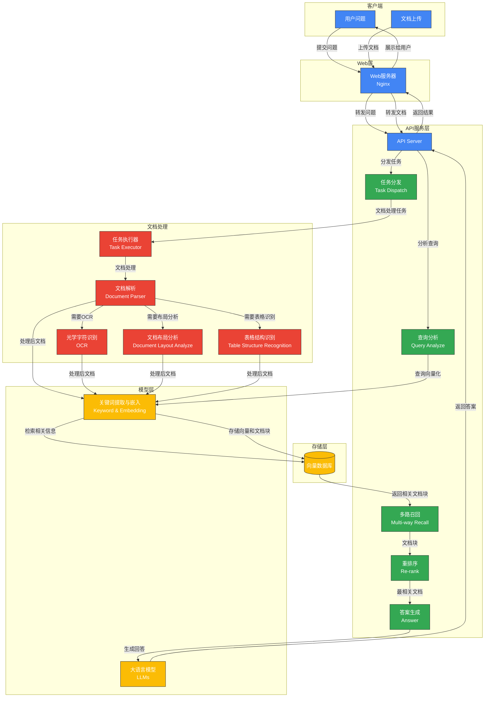

<div align="center">
<a href="https://demo.ragflow.io/">

</a>
</div>


<p align="center">
    <a href="https://x.com/intent/follow?screen_name=infiniflowai" target="_blank">
        
    </a>
    <a href="https://demo.ragflow.io" target="_blank">
        
    </a>
    <a href="https://hub.docker.com/r/infiniflow/ragflow" target="_blank">
        
    </a>
    <a href="https://github.com/infiniflow/ragflow/releases/latest">
        
    </a>
    <a href="https://github.com/infiniflow/ragflow/blob/main/LICENSE">
        
    </a>
</p>

<h4 align="center">
  <a href="https://ragflow.io/docs/dev/">Document</a> |
  <a href="https://github.com/infiniflow/ragflow/issues/4214">Roadmap</a> |
  <a href="https://twitter.com/infiniflowai">Twitter</a> |
  <a href="https://discord.gg/zd4qPW6t">Discord</a> |
  <a href="https://demo.ragflow.io">Demo</a>
</h4>

## 💡 RAGFlow 是什么？

[RAGFlow](https://ragflow.io/) 是一款基于深度文档理解构建的开源 RAG（Retrieval-Augmented Generation）引擎。RAGFlow 可以为各种规模的企业及个人提供一套精简的 RAG 工作流程，结合大语言模型（LLM）针对用户各类不同的复杂格式数据提供可靠的问答以及有理有据的引用。


## 🔥 近期更新

- 2025-02-28 结合互联网搜索（Tavily），对于任意大模型实现类似 Deep Research 的推理功能.
- 2025-02-05 更新硅基流动的模型列表，增加了对 Deepseek-R1/DeepSeek-V3 的支持。
- 2025-01-26 优化知识图谱的提取和应用，提供了多种配置选择。
- 2024-12-18 升级了 DeepDoc 的文档布局分析模型。
- 2024-12-04 支持知识库的 Pagerank 分数。
- 2024-11-22 完善了 Agent 中的变量定义和使用。
- 2024-11-01 对解析后的 chunk 加入关键词抽取和相关问题生成以提高召回的准确度。
- 2024-08-22 支持用 RAG 技术实现从自然语言到 SQL 语句的转换。


## 🌟 主要功能

### 🍭 **"Quality in, quality out"**

- 基于[深度文档理解](./deepdoc/README.md)，能够从各类复杂格式的非结构化数据中提取真知灼见。
- 真正在无限上下文（token）的场景下快速完成大海捞针测试。

### 🍱 **基于模板的文本切片**

- 不仅仅是智能，更重要的是可控可解释。
- 多种文本模板可供选择

### 🌱 **有理有据、最大程度降低幻觉（hallucination）**

- 文本切片过程可视化，支持手动调整。
- 有理有据：答案提供关键引用的快照并支持追根溯源。

### 🍔 **兼容各类异构数据源**

- 支持丰富的文件类型，包括 Word 文档、PPT、excel 表格、txt 文件、图片、PDF、影印件、复印件、结构化数据、网页等。

### 🛀 **全程无忧、自动化的 RAG 工作流**

- 全面优化的 RAG 工作流可以支持从个人应用乃至超大型企业的各类生态系统。
- 大语言模型 LLM 以及向量模型均支持配置。
- 基于多路召回、融合重排序。
- 提供易用的 API，可以轻松集成到各类企业系统。

## 🔎 系统架构

<div align="center" style="margin-top:20px;margin-bottom:20px;">

</div>
一个典型的RAG(检索增强生成)系统架构。我将使用Mermaid语法重新绘制这个架构图，并详细解释各个组件和数据流向，帮助RAG初级开发人员快速理解整个系统。



### 系统组件说明

#### 1. 客户端层
- **用户问题(Questions)**: 用户输入的查询或问题
- **文档(Documents)**: 用户上传的文档，可能包含各种格式(PDF、Word、图片等)

#### 2. Web层
- **Web服务器(Nginx)**: 处理用户请求，负责静态资源分发和请求转发

#### 3. API服务层
- **API Server**: 系统核心，协调各组件工作
- **任务分发(Task Dispatch)**: 将文档处理任务分配给相应的处理模块
- **查询分析(Query Analyze)**: 分析用户查询意图和结构
- **多路召回(Multi-way Recall)**: 从多个维度和方法检索相关信息
- **重排序(Re-rank)**: 对召回的结果进行排序，提高相关性
- **答案生成(Answer)**: 根据检索结果生成最终答案

#### 4. 存储层
- **向量数据库**: 存储文档的向量表示和原文块，支持高效相似度检索

#### 5. 模型层
- **大语言模型(LLMs)**: 用于生成自然语言回答
- **关键词提取与嵌入(Keyword & Embedding)**: 提取文本关键词并生成向量表示

#### 6. 文档处理层
- **文档解析(Document Parser)**: 解析各种格式的文档
- **OCR**: 从图像中提取文本
- **文档布局分析(Document Layout Analyze)**: 理解文档结构
- **表格结构识别(Table Structure Recognition)**: 识别和解析表格
- **任务执行器(Task Executor)**: 执行各种文档处理任务

### 数据流向说明

#### 问题处理流程
1. 用户提交问题
2. Web服务器接收请求并转发到API服务器
3. API服务器调用查询分析模块分析问题
4. 问题经过向量化处理
5. 系统从向量数据库中检索相关文档块
6. 通过多路召回获取候选答案材料
7. 重排序模块对材料进行排序
8. 答案生成模块结合LLM生成最终答案
9. 答案返回给用户

#### 文档处理流程
1. 用户上传文档
2. 文档通过Web服务器转发到API服务器
3. API服务器将文档交给任务分发模块
4. 任务分发模块将处理任务分配给任务执行器
5. 根据文档类型调用相应处理模块(文档解析、OCR、布局分析、表格识别)
6. 处理后的文档转为向量表示
7. 向量和文档块存入数据库，以供后续检索

### 关键环节解析

1. **多路召回机制**: 不同于单一检索方法，多路召回使用多种策略(关键词匹配、语义相似度、知识图谱等)进行检索，提高召回率
   
2. **重排序过程**: 对多路召回的结果进行精排，考虑相关性、新鲜度、权威性等多维度因素

3. **向量化与存储**: 文档经过分块、向量化后存储，是高效检索的基础

4. **任务调度与执行**: 不同文档需要不同处理流程，系统通过任务分发和执行器实现灵活配置

5. **文档处理多样性**: 支持多种文档格式，通过不同模块协同处理复杂文档结构

### 技术实现建议

初级开发人员入手该项目时，可以按以下步骤学习：

1. 从简单的文本文档处理开始，理解基本的向量化和检索流程
2. 学习如何配置和使用向量数据库
3. 集成基本的LLM模型实现问答功能
4. 逐步扩展到复杂文档处理和多路召回

## 🎬 项目结构

RAG（Retrieval-Augmented Generation，检索增强生成）是一种结合了检索系统和生成式AI的技术框架。简单来说，它通过以下步骤工作：

1. 将知识库内容预先处理并存储
2. 当用户提问时，系统先检索相关信息
3. 将检索到的信息作为上下文与用户问题一起发送给LLM
4. LLM基于这些上下文生成更准确的回答

下面让我们详细了解本项目如何实现这一流程。

> 对于RAG初级开发者，推荐按以下顺序学习这个项目：
>
> 1. 首先了解RAG的基本概念和工作原理
> 2. 阅读`docs/`下的开发文档和使用指南
> 3. 熟悉`rag/`模块的核心实现
> 4. 学习如何通过前端界面操作系统
> 5. 尝试使用Python SDK与系统交互
> 6. 进阶学习智能代理和工作流编排
>
> 通过这种方式，可以逐步掌握从基础RAG到复杂智能代理的全部技能。
>

### 一、核心业务模块

#### 1. RAG模块 (rag/)

```
├─rag                     # RAG检索增强生成的核心实现
│  ├─app                 # 应用层逻辑，处理用户请求
│  ├─llm                 # 大语言模型集成（如OpenAI、Claude等）
│  │  └─[各种模型适配器] # 支持多种LLM模型的适配器
│  ├─nlp                 # 自然语言处理组件
│  │  ├─[分词组件]      # 文本分词、向量化等基础NLP功能
│  │  ├─[语义搜索]      # 实现语义相似度搜索
│  │  └─[实体识别]      # 命名实体识别等功能
│  ├─svr                 # 服务层，连接应用与底层功能
│  │  ├─[检索服务]      # 向量检索、关键词检索等服务
│  │  └─[排序服务]      # 搜索结果排序优化
│  ├─res                 # 资源文件（如停用词表等）
│  └─utils               # 工具函数
│     ├─[向量计算]      # 向量相似度计算等
│     ├─[文本处理]      # 文本清洗、格式转换等
│     └─[缓存管理]      # 检索结果缓存等
```

**RAG模块是整个系统的核心**，负责将用户的查询与知识库中的相关内容匹配，并通过LLM生成回答。初级开发者应关注：

- `llm/`: 了解如何集成不同的大语言模型
- `nlp/`: 学习文本如何被处理成向量以便检索
- `svr/`: 理解检索逻辑的核心实现

#### 2. 智能代理模块 (agent/)

```
├─agent                   # 智能代理系统
│  ├─component           # 代理组件库
│  │  ├─[基础组件]      # 如消息处理、环境交互等组件
│  │  ├─[工具组件]      # 集成各种外部工具的组件
│  │  └─[推理组件]      # 处理代理决策推理的组件
│  ├─templates           # 预定义代理模板
│  │  ├─[对话模板]      # 通用对话代理模板
│  │  ├─[研究模板]      # 用于研究任务的代理模板
│  │  └─[专家模板]      # 领域专家代理模板
│  └─test                # 测试用例
│     └─dsl_examples    # 代理DSL语言示例
```

**智能代理模块**将RAG能力与工具调用、工作流编排能力结合，实现更复杂的自动化任务。初级开发者可以:

- 学习代理如何根据上下文做出决策
- 了解不同类型的代理模板适用场景
- 通过DSL示例学习如何编写自定义代理

#### 3. API服务模块 (api/)

```
├─api                     # API服务层
│  ├─apps                # 应用服务集合
│  │  └─sdk             # SDK相关API服务
│  ├─db                  # 数据库访问层
│  │  └─services        # 数据库服务
│  │     ├─[用户服务]   # 用户认证、权限管理
│  │     ├─[知识库服务] # 知识库CRUD操作
│  │     └─[会话服务]   # 对话历史管理
│  └─utils               # API工具函数
│     ├─[请求验证]      # 请求参数验证
│     ├─[响应格式化]    # 统一响应格式
│     └─[错误处理]      # 全局错误处理
```

**API模块**是连接前端与后端核心功能的桥梁，提供RESTful接口供前端调用。初级开发者应关注：

- 如何定义API接口
- 数据库服务如何组织
- 用户认证与权限控制的实现

#### 4. 文档处理模块 (deepdoc/)

```
├─deepdoc                 # 文档智能处理模块
│  ├─parser              # 文档解析器
│  │  └─resume          # 简历解析专用功能
│  │     ├─entities     # 简历实体识别
│  │     │  └─res      # 资源文件
│  │     ├─[教育背景]   # 教育经历提取
│  │     ├─[工作经验]   # 工作经验提取
│  │     └─[技能识别]   # 技能提取
│  └─vision              # 计算机视觉处理
│     ├─[OCR功能]       # 图像文字识别
│     ├─[图表识别]      # 图表数据提取
│     └─[布局分析]      # 文档布局结构分析
```

**文档处理模块**负责从各种文档中提取结构化信息，是知识库建设的基础。初级开发者可以学习：

- 如何从非结构化文档中提取信息
- 特定领域（如简历）的解析逻辑
- 视觉信息处理的基本流程

#### 5. 图形化RAG模块 (graphrag/)

```
├─graphrag                # 图形化RAG实现
│  ├─general             # 通用图RAG实现
│  │  ├─[图构建]        # 知识图谱构建
│  │  ├─[图存储]        # 图数据库接口
│  │  └─[图检索]        # 图结构检索算法
│  └─light               # 轻量级图RAG实现
│     ├─[内存图]        # 内存中的图结构
│     ├─[简化检索]      # 简化版图检索
│     └─[可视化]        # 图结构可视化
```

**图形化RAG模块**将传统RAG与图结构结合，支持更复杂的知识推理。这对初级开发者来说可能较为复杂，但可以了解：

- 知识图谱的基本概念
- 图结构如何增强传统RAG的检索能力
- 轻量级实现与完整实现的区别

### 二、前端模块 (web/)

#### 1. 前端结构

> - 基于 React + TypeScript 开发
> - 使用 UmiJS 框架构建
> - 采用 Tailwind CSS 进行样式管理
> - 支持国际化（i18n）
> - 包含完整的组件库和工具函数
> - 提供主题定制能力

```
web/
├── src/              # 源代码
│   ├── assets/       # 静态资源
│   ├── components/   # 通用组件
│   ├── constants/    # 常量定义
│   ├── hooks/        # React Hooks
│   ├── icons/        # 图标资源
│   ├── interfaces/   # TypeScript 接口定义
│   ├── layouts/      # 页面布局
│   ├── lib/          # 工具库
│   ├── locales/      # 国际化资源
│   ├── pages/        # 页面组件
│   ├── services/     # API 服务
│   ├── theme/        # 主题相关
│   ├── utils/        # 工具函数
│   ├── wrappers/     # 组件包装器
│   ├── app.tsx       # 应用入口
│   └── routes.ts     # 路由配置
├── public/           # 静态资源
├── .umirc.ts         # UmiJS 配置
├── package.json      # 项目依赖
├── tailwind.config.js # Tailwind CSS 配置
└── tsconfig.json     # TypeScript 配置
```

#### 2. 页面组件

```
└─web
    └─src
        ├─pages               # 页面组件
        │  ├─add-knowledge    # 知识库管理页面
        │  │  └─components    # 知识库相关组件
        │  │     ├─knowledge-chunk      # 知识块管理
        │  │     ├─knowledge-dataset    # 数据集管理
        │  │     ├─knowledge-file       # 文件管理
        │  │     ├─knowledge-graph      # 知识图谱
        │  │     ├─knowledge-setting    # 知识库设置
        │  │     ├─knowledge-sidebar    # 侧边栏
        │  │     └─knowledge-testing    # 知识库测试
        │  │
        │  ├─agent           # 智能代理页面
        │  │  ├─canvas       # 代理可视化画布
        │  │  ├─debug-content # 调试面板
        │  │  ├─form         # 代理表单配置
        │  │  └─form-sheet   # 表单编辑器
        │  │
        │  ├─chat            # 聊天功能页面
        │  │  ├─chat-container        # 聊天界面
        │  │  ├─chat-configuration-modal # 聊天配置
        │  │  └─markdown-content     # Markdown渲染
        │  │
        │  ├─dataset         # 数据集管理页面
        │  ├─file-manager    # 文件管理页面
        │  └─flow            # 工作流页面
        │     ├─canvas       # 工作流画布
        │     ├─form         # 节点表单
        │     └─list         # 工作流列表
```

**前端页面模块**实现了系统的用户界面，开发者可以重点关注：

- `add-knowledge/`: 学习知识库构建的前端流程
- `chat/`: 了解聊天界面如何与后端RAG交互
- `agent/`和`flow/`: 学习如何可视化编排智能工作流

#### 3. 通用组件

```
└─web
    └─src
        ├─components           # 通用组件
        │  ├─api-service      # API服务组件
        │  │  ├─chat-api-key-modal  # API密钥设置
        │  │  └─embed-modal        # 嵌入设置
        │  │
        │  ├─file-upload      # 文件上传组件
        │  ├─message-input    # 消息输入组件
        │  ├─message-item     # 消息展示组件
        │  ├─pdf-previewer    # PDF预览组件
        │  ├─prompt-editor    # 提示词编辑器
        │  ├─retrieval-documents # 检索文档展示
        │  └─ui               # 基础UI组件
```

**通用组件**封装了可复用的UI元素，初级开发者可以学习：

- `prompt-editor/`: 提示词编辑的最佳实践
- `retrieval-documents/`: 检索结果的展示方式
- `message-input/`和`message-item/`: 聊天界面的核心组件

#### 4. 服务与工具

```
└─web
    └─src
        ├─services            # 前端服务层
        │  ├─[API服务]       # 后端API调用封装
        │  ├─[状态管理]      # 全局状态管理
        │  └─[WebSocket]     # 实时通信服务
        │
        ├─utils              # 前端工具函数
        │  ├─[格式转换]      # 数据格式转换
        │  ├─[验证工具]      # 表单验证
        │  └─[帮助函数]      # 通用帮助函数
```

**服务与工具**为前端提供基础能力，初级开发者应了解：

- 前端如何调用后端API
- 实时通信如何实现
- 前端状态管理的基本模式

### 三、SDK与集成模块

#### 1. Python SDK

```
├─sdk                     # SDK模块
│  └─python              # Python SDK
│      ├─ragflow_sdk     # SDK核心实现
│      │  └─modules      # 功能模块
│      │     ├─[知识库管理] # 知识库操作API
│      │     ├─[代理操作]  # 代理调用API
│      │     └─[对话接口]  # 聊天功能API
│      │
│      └─test            # 测试用例
│          ├─test_frontend_api   # 前端API测试
│          ├─test_http_api       # HTTP API测试
│          └─test_sdk_api        # SDK API测试
```

**Python SDK**提供了编程方式访问系统功能的能力，初级开发者可以：

- 学习如何通过SDK与系统交互
- 了解API设计的最佳实践
- 通过测试用例学习功能使用方法

#### 2. 第三方集成

```
├─intergrations          # 第三方集成
│  ├─chatgpt-on-wechat  # 微信集成
│  │  └─plugins         # 微信插件
│  │     ├─[对话插件]   # 处理对话消息
│  │     └─[命令插件]   # 处理命令消息
│  │
│  └─extension_chrome    # Chrome扩展
│      ├─assets         # 静态资源
│      ├─icons          # 图标文件
│      └─styles         # 样式文件
```

**第三方集成**将系统能力扩展到其他平台，初级开发者可以了解：

- 如何将RAG能力集成到微信等社交平台
- 浏览器扩展如何与系统交互
- 多平台集成的技术选型

### 四、部署与配置

#### 1. Docker与Kubernetes配置

```
├─docker                  # Docker配置
│  └─nginx               # Nginx配置
│     ├─[配置文件]      # Nginx服务器配置
│     └─[SSL证书]       # HTTPS证书配置
│
├─helm                    # Kubernetes部署
│  └─templates           # Helm模板
│     ├─[部署配置]      # 部署描述文件
│     ├─[服务配置]      # 服务描述文件
│     └─tests           # 测试配置
```

**部署与配置**部分负责系统的容器化与云部署，初级开发者可以学习：

- Docker容器化的基本概念
- Kubernetes部署的配置方法
- 微服务架构的部署策略

#### 2. 文档与配置

```
├─conf                    # 配置文件
│  ├─[系统配置]         # 全局系统配置
│  ├─[模型配置]         # LLM模型配置
│  └─[服务配置]         # 各服务配置
│
├─docs                    # 文档
│  ├─develop             # 开发文档
│  │  ├─[架构设计]      # 系统架构说明
│  │  ├─[API文档]       # API接口说明
│  │  └─[部署指南]      # 部署步骤说明
│  │
│  ├─guides              # 使用指南
│  │  ├─agent           # 代理使用指南
│  │  ├─chat            # 聊天功能指南
│  │  └─dataset         # 数据集管理指南
│  │
│  └─references          # 参考资料
│     ├─[概念解释]      # 核心概念说明
│     └─[最佳实践]      # 推荐实践方法
```

**文档与配置**是学习系统的重要资源，初级开发者应该：

- 通过开发文档了解系统架构与设计理念
- 通过使用指南学习各功能模块的使用方法
- 参考配置文件学习系统的配置选项

#### 其他文件

- `pyproject.toml`: Python 项目配置和依赖管理
- `Dockerfile`: 主 Docker 构建文件
- `Dockerfile.deps`: 依赖构建文件
- `download_deps.py`: 依赖下载脚本
- `show_env.sh`: 环境变量显示脚本
- `SECURITY.md`: 安全策略文档
- `LICENSE`: 开源许可证
- `CONTRIBUTING.md`: 贡献指南

## **🏄** 快速开始

### 📝 前提条件

- CPU >= 4 核
- RAM >= 16 GB
- Disk >= 50 GB
- Docker >= 24.0.0 & Docker Compose >= v2.26.1
  > 如果你并没有在本机安装 Docker（Windows、Mac，或者 Linux）, 可以参考文档 [Install Docker Engine](https://docs.docker.com/engine/install/) 自行安装。

### 🚀 启动服务器

1. 确保 `vm.max_map_count` 不小于 262144：

   > - **`max_map_count`**:  这是一个内核参数，用于限制一个进程可以拥有的 **内存映射区域 (memory map areas)** 的最大数量。
   >
   > **什么是内存映射区域？**
   >
   > 内存映射是一种将文件或设备的内容直接映射到进程的虚拟地址空间的技术。这使得进程可以像访问内存一样访问文件或设备的内容，而无需进行显式的读写操作。

   > 如需确认 `vm.max_map_count` 的大小：
   >
   > ```bash
   > $ sysctl vm.max_map_count
   > ```
   >
   > 如果 `vm.max_map_count` 的值小于 262144，可以进行重置：
   >
   > ```bash
   > # 这里我们设为 262144:
   > $ sudo sysctl -w vm.max_map_count=262144
   > ```
   >
   > 你的改动会在下次系统重启时被重置。如果希望做永久改动，还需要在 **/etc/sysctl.conf** 文件里把 `vm.max_map_count` 的值再相应更新一遍：
   >
   > ```bash
   > vm.max_map_count=262144
   > ```

2. 克隆仓库：

   ```bash
   $ git clone https://github.com/infiniflow/ragflow.git
   ```

3. 进入 **docker** 文件夹，利用提前编译好的 Docker 镜像启动服务器：

   > 运行以下命令会自动下载 RAGFlow slim Docker 镜像 `v0.17.2-slim`。请参考下表查看不同 Docker 发行版的描述。如需下载不同于 `v0.17.2-slim` 的 Docker 镜像，请在运行 `docker compose` 启动服务之前先更新 **docker/.env** 文件内的 `RAGFLOW_IMAGE` 变量。比如，你可以通过设置 `RAGFLOW_IMAGE=infiniflow/ragflow:v0.17.2` 来下载 RAGFlow 镜像的 `v0.17.2` 完整发行版。

   ```bash
   $ cd ragflow/docker
   # Use CPU for embedding and DeepDoc tasks:
   $ docker compose -f docker-compose.yml up -d

   # To use GPU to accelerate embedding and DeepDoc tasks:
   # docker compose -f docker-compose-gpu.yml up -d
   ```

   | RAGFlow image tag | Image size (GB) | Has embedding models? | Stable?                  |
   | ----------------- | --------------- | --------------------- | ------------------------ |
   | v0.17.2           | &approx;9       | :heavy_check_mark:    | Stable release           |
   | v0.17.2-slim      | &approx;2       | ❌                    | Stable release           |
   | nightly           | &approx;9       | :heavy_check_mark:    | _Unstable_ nightly build |
   | nightly-slim      | &approx;2       | ❌                     | _Unstable_ nightly build |

   > [!TIP]
   > 如果你遇到 Docker 镜像拉不下来的问题，可以在 **docker/.env** 文件内根据变量 `RAGFLOW_IMAGE` 的注释提示选择华为云或者阿里云的相应镜像。
   >
   > - 华为云镜像名：`swr.cn-north-4.myhuaweicloud.com/infiniflow/ragflow`
   > - 阿里云镜像名：`registry.cn-hangzhou.aliyuncs.com/infiniflow/ragflow`

4. 服务器启动成功后再次确认服务器状态：

   ```bash
   $ docker logs -f ragflow-server
   ```

   _出现以下界面提示说明服务器启动成功：_

   ```bash
        ____   ___    ______ ______ __
       / __ \ /   |  / ____// ____// /____  _      __
      / /_/ // /| | / / __ / /_   / // __ \| | /| / /
     / _, _// ___ |/ /_/ // __/  / // /_/ /| |/ |/ /
    /_/ |_|/_/  |_|\____//_/    /_/ \____/ |__/|__/

    * Running on all addresses (0.0.0.0)
   ```

   > 如果您在没有看到上面的提示信息出来之前，就尝试登录 RAGFlow，你的浏览器有可能会提示 `network anormal` 或 `网络异常`。

5. 在你的浏览器中输入你的服务器对应的 IP 地址并登录 RAGFlow。
   > 上面这个例子中，您只需输入 http://IP_OF_YOUR_MACHINE 即可：未改动过配置则无需输入端口（默认的 HTTP 服务端口 80）。
6. 在 [service_conf.yaml.template](./docker/service_conf.yaml.template) 文件的 `user_default_llm` 栏配置 LLM factory，并在 `API_KEY` 栏填写和你选择的大模型相对应的 API key。

   > 详见 [llm_api_key_setup](https://ragflow.io/docs/dev/llm_api_key_setup)。

   _好戏开始，接着奏乐接着舞！_

## 🔧 系统配置

系统配置涉及以下三份文件：

- [./docker/.env](./docker/.env)：存放一些基本的系统环境变量，比如 `SVR_HTTP_PORT`、`MYSQL_PASSWORD`、`MINIO_PASSWORD` 等。
- [service_conf.yaml.template](./docker/service_conf.yaml.template)：配置各类后台服务。
- [docker-compose.yml](./docker/docker-compose.yml): 系统依赖该文件完成启动。

请务必确保 [./docker/.env](./docker/.env) 文件中的变量设置与 [service_conf.yaml.template](./docker/service_conf.yaml.template) 文件中的配置保持一致！

如果不能访问镜像站点 hub.docker.com 或者模型站点 huggingface.co，请按照 [./docker/.env](./docker/.env) 注释修改 `RAGFLOW_IMAGE` 和 `HF_ENDPOINT`。

> [./docker/README](./docker/README.md) 解释了 [service_conf.yaml.template](./docker/service_conf.yaml.template) 用到的环境变量设置和服务配置。

如需更新默认的 HTTP 服务端口(80), 可以在 [docker-compose.yml](./docker/docker-compose.yml) 文件中将配置 `80:80` 改为 `<YOUR_SERVING_PORT>:80`。

> 所有系统配置都需要通过系统重启生效：
>
> ```bash
> $ docker compose -f docker-compose.yml up -d
> ```

## 🔨 以源代码启动服务

### 启动后端

1. 安装 uv。如已经安装，可跳过本步骤：

   ```bash
   pip install pipx
   pipx install uv
   export UV_INDEX=https://mirrors.aliyun.com/pypi/simple
   ```

   > - **`pip` 用于安装 Python 库，这些库是构建其他 Python 项目的基础。** 你通常会在项目特定的虚拟环境中使用 `pip`。
   > - **`pipx` 用于安装 Python 应用程序，这些应用程序是你可以直接在命令行运行的独立工具。** `pipx` 会确保每个应用程序都在其自己的隔离环境中运行。
   > - `conda` 和 `pipx` 可以很好地协同工作。`conda` 用于管理项目级别的环境和依赖，而 `pipx` 可以用于在这些环境中安全地安装和运行独立的 Python 应用程序。

   ```bash
   # uv命令生效
   pipx ensurepath
   ```

2. 下载源代码并安装 Python 依赖：

   ```bash
   git clone https://github.com/infiniflow/ragflow.git
   cd ragflow/
   uv sync --python 3.10 --all-extras # install RAGFlow dependent python modules
   ```

3. 通过 Docker Compose 启动依赖的服务（MinIO, Elasticsearch, Redis, and MySQL）：

   ```bash
   docker-compose -f docker/docker-compose-base.yml up -d --force-recreate
   ```

   在 `/etc/hosts` 中添加以下代码，将 **conf/service_conf.yaml** 文件中的所有 host 地址都解析为 `127.0.0.1`：

   ```
   127.0.0.1       es01 infinity mysql minio redis
   ```

4. 如果无法访问 HuggingFace，可以把环境变量 `HF_ENDPOINT` 设成相应的镜像站点：

   ```bash
   export HF_ENDPOINT=https://hf-mirror.com
   ```

5. 启动后端服务：

   ```bash
   source .venv/bin/activate
   export PYTHONPATH=$(pwd)
   bash /root/ragflow/docker/launch_backend_service.sh
   ```

### 启动前端

6. 安装前端依赖：

   ```bash
   cd web
   apt install npm
   npm install
   ```

7. 启动前端服务：

   ```bash
   cd /root/ragflow/web
   npm run dev
   ```
   
   _以下界面说明系统已经成功启动：_
   
   

### 组件访问

根据 `docker/.env` 文件的配置，以下是各个组件的详细访问信息：

#### 1. ElasticSearch
- 访问地址：`http://192.168.172.128:1200`
- 账号：elastic
- 密码：infini_rag_flow

#### 2. Kibana
- 访问地址：`http://192.168.172.128:6601`
- 账号：rag_flow
- 密码：infini_rag_flow

##### 使用 Kibana 查询和可视化 Elasticsearch 中的向量数据

根据配置文件，我可以看到：

- Kibana 运行在 6601 端口 (KIBANA_PORT=6601)
- Elasticsearch 运行在 1200 端口 (ES_PORT=1200)
- 登录凭证：
  - 用户名：rag_flow (KIBANA_USER)
  - 密码：infini_rag_flow (KIBANA_PASSWORD)

让我为你详细说明如何使用 Kibana 查询向量数据：

1. **访问 Kibana**
   - 打开浏览器，访问 `http://localhost:6601`
   - 使用以下凭证登录：
     - 用户名：rag_flow
     - 密码：infini_rag_flow

2. **查看向量数据**
   在 Kibana 中查询向量数据的步骤：

   a. **使用 Dev Tools**
   - 点击左侧菜单栏的 "Dev Tools"（开发工具）
   - 在 Console 中可以直接执行 Elasticsearch 查询

   b. **查看索引数据**
   ```bash
   # 查看所有索引
   GET _cat/indices?v
   # 查找ragflow_开头
   # 如：ragflow_e24416a9106d11f0a4a9c73ddb33c1ac
   
   # 查看向量索引的映射结构
   GET your_index_name/_mapping
   
   GET ragflow_e24416a9106d11f0a4a9c73ddb33c1ac/_mapping
   ```
   
   c. **查询向量数据**
   ```json
   # 基本查询示例
   GET your_index_name/_search
   {
     "query": {
       "match_all": {}
     }
   }
   
   # 向量相似度查询示例
   GET ragflow_e24416a9106d11f0a4a9c73ddb33c1ac/_search
   {
     "query": {
       "script_score": {
         "query": {
           "match_all": {}
         },
         "script": {
           "source": "cosineSimilarity(params.query_vector, 'vector_field') + 1.0",
           "params": {
             "query_vector": [0.024323905304040452] // 你的查询向量
           }
         }
       }
     }
   }
   ```

**注意事项：**
1. 向量数据通常是高维数据，直接可视化可能不太直观。建议先进行降维处理（如 PCA、t-SNE）后再可视化。
2. 在进行向量相似度搜索时，确保使用正确的相似度计算方法（cosine similarity、euclidean distance 等）。
3. 对于大规模向量数据，建议使用适当的分页和限制来优化查询性能。

#### 3. Infinity（向量数据库，可选）
- Thrift 端口：23817
- HTTP 端口：23820
- PostgreSQL 端口：5432
- 主机名：infinity

#### 4. MySQL
- 访问端口：`5455`
- 数据库名：rag_flow
- 密码：infini_rag_flow

#### 5. MinIO（对象存储）
- API 访问地址：`http://192.168.172.128:9000`
- 控制台地址：`http://192.168.172.128:9001`
- 用户名：rag_flow
- 密码：infini_rag_flow

#### 6. Redis
- 访问地址：`redis:6379`
- 密码：infini_rag_flow

#### 7. RAGFlow API服务
- HTTP API 地址：`http://192.168.172.128:9380`

### 注意事项：
1. 所有服务都配置在同一个 Docker 网络中，服务之间可以通过服务名互相访问
2. 对外暴露的端口可以通过 localhost 访问
3. 文件上传大小默认限制为 1GB
4. 系统默认启用了用户注册功能（REGISTER_ENABLED=1）
5. 时区设置为 Asia/Shanghai

这些配置都可以在 `docker/.env` 文件中进行修改。如果需要修改任何配置，建议在更改前备份原始配置文件。

## 部署常见问题

### 后端服务报错

#### uv sync 

```bash
uv sync --python 3.10 --all-extras
Using CPython 3.10.16 interpreter at: /root/miniconda3/envs/ragflow/bin/python3.10
Creating virtual environment at: .venv
Resolved 380 packages in 1ms
  × Failed to build `pyicu==2.15`
  ├─▶ The build backend returned an error
  ╰─▶ Call to `setuptools.build_meta.build_wheel` failed (exit status: 1)

      [stdout]
      (running 'icu-config --version')
      (running 'pkg-config --modversion icu-i18n')

      [stderr]
      Traceback (most recent call last):
        File "<string>", line 89, in <module>
        File "/root/miniconda3/envs/ragflow/lib/python3.10/os.py", line 680, in __getitem__
          raise KeyError(key) from None
      KeyError: 'ICU_VERSION'

      During handling of the above exception, another exception occurred:

      Traceback (most recent call last):
        File "<string>", line 92, in <module>
        File "<string>", line 19, in check_output
        File "/root/miniconda3/envs/ragflow/lib/python3.10/subprocess.py", line 421, in check_output
          return run(*popenargs, stdout=PIPE, timeout=timeout, check=True,
        File "/root/miniconda3/envs/ragflow/lib/python3.10/subprocess.py", line 503, in run
          with Popen(*popenargs, **kwargs) as process:
        File "/root/miniconda3/envs/ragflow/lib/python3.10/subprocess.py", line 971, in __init__
          self._execute_child(args, executable, preexec_fn, close_fds,
        File "/root/miniconda3/envs/ragflow/lib/python3.10/subprocess.py", line 1863, in _execute_child
          raise child_exception_type(errno_num, err_msg, err_filename)
      FileNotFoundError: [Errno 2] No such file or directory: 'icu-config'

      During handling of the above exception, another exception occurred:

      Traceback (most recent call last):
        File "<string>", line 96, in <module>
        File "<string>", line 19, in check_output
        File "/root/miniconda3/envs/ragflow/lib/python3.10/subprocess.py", line 421, in check_output
          return run(*popenargs, stdout=PIPE, timeout=timeout, check=True,
        File "/root/miniconda3/envs/ragflow/lib/python3.10/subprocess.py", line 503, in run
          with Popen(*popenargs, **kwargs) as process:
        File "/root/miniconda3/envs/ragflow/lib/python3.10/subprocess.py", line 971, in __init__
          self._execute_child(args, executable, preexec_fn, close_fds,
        File "/root/miniconda3/envs/ragflow/lib/python3.10/subprocess.py", line 1863, in _execute_child
          raise child_exception_type(errno_num, err_msg, err_filename)
      FileNotFoundError: [Errno 2] No such file or directory: 'pkg-config'

      During handling of the above exception, another exception occurred:

      Traceback (most recent call last):
        File "<string>", line 14, in <module>
        File "/root/.cache/uv/builds-v0/.tmpE66vpR/lib/python3.10/site-packages/setuptools/build_meta.py", line 334, in get_requires_for_build_wheel
          return self._get_build_requires(config_settings, requirements=[])
        File "/root/.cache/uv/builds-v0/.tmpE66vpR/lib/python3.10/site-packages/setuptools/build_meta.py", line 304, in _get_build_requires
          self.run_setup()
        File "/root/.cache/uv/builds-v0/.tmpE66vpR/lib/python3.10/site-packages/setuptools/build_meta.py", line 320, in run_setup
          exec(code, locals())
        File "<string>", line 99, in <module>
      RuntimeError:
      Please install pkg-config on your system or set the ICU_VERSION environment
      variable to the version of ICU you have installed.
      

      hint: This usually indicates a problem with the package or the build environment.
  help: `pyicu` (v2.15) was included because `ragflow` (v0.17.2) depends on `pyicu`
```

你看到的错误信息表明在安装 `ragflow` 的过程中，其依赖项 `pyicu` 的构建失败了。错误原因是构建 `pyicu` 时找不到 `icu-config` 和 `pkg-config` 这两个工具。错误信息也提示你可以设置 `ICU_VERSION` 环境变量作为替代方案。

这通常意味着你的系统中缺少构建 `pyicu` 所需的系统库和开发工具。你需要安装 Unicode 国际化组件 (ICU) 库和 `pkg-config` 到你的系统中。

以下是如何解决这个问题的方法，具体取决于你的操作系统：

**Windows系统**

解决方法：点击https://www.lfd.uci.edu/~gohlke/pythonlibs/下载Unofficial Windows Binaries for Python Extension Packages。

> 注意：选择对应自己Python和OS版本的包名。如 *pyICU‑2.1‑cp36‑cp36m‑winamd64.whl* 文件名中 *cp36* 表示 Python3.6, *win_amd64* 表示 Windows-64bit。

下载完成后在cmd中执行 pip install <.whl的绝对路径>，如

```
pip install D:\Desktop\pyicu-2.15-cp310-cp310-win_amd64.whl
```

**Ubuntu 的系统**

1. 更新你的软件包列表：

   ```Bash
   sudo apt update
   ```

2. 安装 ICU 开发库和 pkg-config：

   ```Bash
   sudo apt install libicu-dev pkg-config
   ```

在安装 `libicu-dev` 和 `pkg-config` 后，你可以使用以下命令来查看版本：

- **`libicu-dev` 包版本:** `dpkg -s libicu-dev | grep Version` 或 `apt-cache policy libicu-dev`
- **ICU 库版本:** `icu-config --version`
- **`pkg-config` 版本:** `pkg-config --versionb`

```bash
(ragflow) root@fly:~# dpkg -s libicu-dev | grep Version
Version: 70.1-2
(ragflow) root@fly:~# pkg-config --version
0.29.2
```

**安装必要的软件包后，再次尝试安装 `ragflow`：**

```
git clone https://github.com/infiniflow/ragflow.git
cd ragflow
uv sync --python 3.10 --all-extras
```

#### launch_backend_service

```bash
$ bash docker/launch_backend_service.sh
Loading environment variables from: /root/AI-Box/rag/ragflow/docker/.env
Package jemalloc was not found in the pkg-config search path.
Perhaps you should add the directory containing `jemalloc.pc'
to the PKG_CONFIG_PATH environment variable
No package 'jemalloc' found
```

看起来你的脚本 `launch_backend_service.sh` 运行失败，错误信息表明系统找不到 `jemalloc` 库。`jemalloc` 是一个内存分配器，有时用于提升应用程序的性能。

**问题分析:**

错误信息显示：

1. `pkg-config` 找不到 `jemalloc` 包。`pkg-config` 是一个帮助检索已安装库信息的实用工具。

2. 因此，脚本无法使用以下命令确定  `libjemalloc.so` 的路径：

   ```
   JEMALLOC_PATH=$(pkg-config --variable=libdir jemalloc)/libjemalloc.so
   ```

   这很可能导致 `JEMALLOC_PATH` 变量为空或不正确，该变量在之后运行 `task_executor.py` 时通过 `LD_PRELOAD` 使用。

**解决方案:**

你需要在运行此脚本的系统上安装 `jemalloc` 库。由于你的系统是 Ubuntu 22.04，你可以使用 `apt` 包管理器来安装。

**如果你的脚本在 Docker 容器中运行:**

最好的方法是修改你的 Dockerfile，加入安装 `jemalloc` 的步骤。对于 Ubuntu 基础的镜像，你可以添加以下行到你的 Dockerfile 中，在构建或运行你的应用程序的步骤之前：

```Dockerfile
RUN apt-get update && apt-get install -y libjemalloc-dev
```

或者有时也可以使用：

```Dockerfile
RUN apt-get update && apt-get install -y jemalloc
```

添加这行之后，你需要重新构建你的 Docker 镜像。

**如果你的脚本直接在你的 Ubuntu 22.04 主机上运行 (不在 Docker 中):**

你可以打开终端并运行以下命令来安装 `jemalloc`：

```Bash
sudo apt-get update
sudo apt-get install libjemalloc-dev
```

或者：

```Bash
sudo apt-get update
sudo apt-get install jemalloc
```

#### ImportError: libGL.so.1: cannot open shared object file: No such file or directory

```bash
bash docker/launch_backend_service.sh
Loading environment variables from: /root/ragflow/docker/.env
Starting task_executor.py for task 0 (Attempt 1)
Starting ragflow_server.py (Attempt 1)
2025-04-03 16:31:09,502 INFO     699638 ragflow_server log path: /root/ragflow/logs/ragflow_server.log, log levels: {'peewee': 'WARNING', 'pdfminer': 'WARNING', 'root': 'INFO'}
2025-04-03 16:31:12,082 INFO     699638 found 0 gpus
2025-04-03 16:31:17,856 INFO     699638 init database on cluster mode successfully
Traceback (most recent call last):
  File "/root/ragflow/api/ragflow_server.py", line 36, in <module>
    from api.apps import app
  File "/root/ragflow/api/apps/__init__.py", line 137, in <module>
    client_urls_prefix = [
  File "/root/ragflow/api/apps/__init__.py", line 138, in <listcomp>
    register_page(path) for dir in pages_dir for path in search_pages_path(dir)
  File "/root/ragflow/api/apps/__init__.py", line 120, in register_page
    spec.loader.exec_module(page)
  File "/root/ragflow/api/apps/chunk_app.py", line 22, in <module>
    from rag.app.qa import rmPrefix, beAdoc
  File "/root/ragflow/rag/app/qa.py", line 25, in <module>
    from deepdoc.parser.utils import get_text
  File "/root/ragflow/deepdoc/parser/__init__.py", line 17, in <module>
    from .pdf_parser import RAGFlowPdfParser as PdfParser, PlainParser
  File "/root/ragflow/deepdoc/parser/pdf_parser.py", line 37, in <module>
    from deepdoc.vision import OCR, LayoutRecognizer, Recognizer, TableStructureRecognizer
  File "/root/ragflow/deepdoc/vision/__init__.py", line 21, in <module>
    from .ocr import OCR
  File "/root/ragflow/deepdoc/vision/ocr.py", line 26, in <module>
    from .operators import *  # noqa: F403
  File "/root/ragflow/deepdoc/vision/operators.py", line 20, in <module>
    import cv2
  File "/root/ragflow/.venv/lib/python3.10/site-packages/cv2/__init__.py", line 181, in <module>
    bootstrap()
  File "/root/ragflow/.venv/lib/python3.10/site-packages/cv2/__init__.py", line 153, in bootstrap
    native_module = importlib.import_module("cv2")
  File "/usr/lib/python3.10/importlib/__init__.py", line 126, in import_module
    return _bootstrap._gcd_import(name[level:], package, level)
ImportError: libGL.so.1: cannot open shared object file: No such file or directory
Traceback (most recent call last):
  File "/root/ragflow/rag/svr/task_executor.py", line 50, in <module>
    from api.db.services.task_service import TaskService
  File "/root/ragflow/api/db/services/task_service.py", line 22, in <module>
    from deepdoc.parser import PdfParser
  File "/root/ragflow/deepdoc/parser/__init__.py", line 17, in <module>
    from .pdf_parser import RAGFlowPdfParser as PdfParser, PlainParser
  File "/root/ragflow/deepdoc/parser/pdf_parser.py", line 37, in <module>
    from deepdoc.vision import OCR, LayoutRecognizer, Recognizer, TableStructureRecognizer
  File "/root/ragflow/deepdoc/vision/__init__.py", line 21, in <module>
    from .ocr import OCR
  File "/root/ragflow/deepdoc/vision/ocr.py", line 26, in <module>
    from .operators import *  # noqa: F403
  File "/root/ragflow/deepdoc/vision/operators.py", line 20, in <module>
    import cv2
  File "/root/ragflow/.venv/lib/python3.10/site-packages/cv2/__init__.py", line 181, in <module>
    bootstrap()
  File "/root/ragflow/.venv/lib/python3.10/site-packages/cv2/__init__.py", line 153, in bootstrap
    native_module = importlib.import_module("cv2")
  File "/usr/lib/python3.10/importlib/__init__.py", line 126, in import_module
    return _bootstrap._gcd_import(name[level:], package, level)
ImportError: libGL.so.1: cannot open shared object file: No such file or directory

```

这个错误是因为系统中缺少 OpenCV (cv2) 所需的系统库 libGL.so.1。这是一个常见的依赖问题，特别是在 Docker 容器中运行 OpenCV 时。让我帮您解决这个问题。

我们需要安装必要的系统依赖。我将创建一个命令来安装所需的包：

```bash
apt-get update && apt-get install -y libgl1-mesa-glx
```

##### ImportError: libodbc.so.2: cannot open shared object file: No such file or directory

```bash
bash docker/launch_backend_service.sh
Loading environment variables from: /root/ragflow/docker/.env
Starting ragflow_server.py (Attempt 1)
Starting task_executor.py for task 0 (Attempt 1)
2025-04-03 17:19:05,520 INFO     715556 ragflow_server log path: /root/ragflow/logs/ragflow_server.log, log levels: {'peewee': 'WARNING', 'pdfminer': 'WARNING', 'root': 'INFO'}
2025-04-03 17:19:10,366 INFO     715556 found 0 gpus
2025-04-03 17:19:12,749 INFO     715556 init database on cluster mode successfully
2025-04-03 17:19:14,549 INFO     715556 load_model /root/ragflow/rag/res/deepdoc/det.onnx uses CPU
2025-04-03 17:19:14,703 INFO     715556 load_model /root/ragflow/rag/res/deepdoc/rec.onnx uses CPU
Traceback (most recent call last):
  File "/root/ragflow/api/ragflow_server.py", line 36, in <module>
    from api.apps import app
  File "/root/ragflow/api/apps/__init__.py", line 137, in <module>
    client_urls_prefix = [
  File "/root/ragflow/api/apps/__init__.py", line 138, in <listcomp>
    register_page(path) for dir in pages_dir for path in search_pages_path(dir)
  File "/root/ragflow/api/apps/__init__.py", line 120, in register_page
    spec.loader.exec_module(page)
  File "/root/ragflow/api/apps/api_app.py", line 45, in <module>
    from api.db.services.canvas_service import UserCanvasService
  File "/root/ragflow/api/db/services/canvas_service.py", line 20, in <module>
    from agent.canvas import Canvas
  File "/root/ragflow/agent/canvas.py", line 23, in <module>
    from agent.component import component_class
  File "/root/ragflow/agent/component/__init__.py", line 41, in <module>
    from .exesql import ExeSQL, ExeSQLParam
  File "/root/ragflow/agent/component/exesql.py", line 24, in <module>
    import pyodbc
ImportError: libodbc.so.2: cannot open shared object file: No such file or directory
2025-04-03 17:19:27,225 INFO     715557 task_executor_0 log path: /root/ragflow/logs/task_executor_0.log, log levels: {'peewee': 'WARNING', 'pdfminer': 'WARNING', 'root': 'INFO'}
2025-04-03 17:19:27,226 INFO     715557 
  ______           __      ______                     __            
 /_  __/___ ______/ /__   / ____/  _____  _______  __/ /_____  _____
  / / / __ `/ ___/ //_/  / __/ | |/_/ _ \/ ___/ / / / __/ __ \/ ___/
 / / / /_/ (__  ) ,<    / /____>  </  __/ /__/ /_/ / /_/ /_/ / /    
/_/  \__,_/____/_/|_|  /_____/_/|_|\___/\___/\__,_/\__/\____/_/                               
    
2025-04-03 17:19:27,275 INFO     715557 TaskExecutor: RAGFlow version: v0.17.2-187-g2a80aac1 full
2025-04-03 17:19:27,276 INFO     715557 Use Elasticsearch http://localhost:1200 as the doc engine.
2025-04-03 17:19:27,305 INFO     715557 GET http://localhost:1200/ [status:200 duration:0.026s]
2025-04-03 17:19:27,308 INFO     715557 HEAD http://localhost:1200/ [status:200 duration:0.003s]
2025-04-03 17:19:27,308 INFO     715557 Elasticsearch http://localhost:1200 is healthy.
2025-04-03 17:19:27,313 WARNING  715557 Load term.freq FAIL!
2025-04-03 17:19:27,316 WARNING  715557 Realtime synonym is disabled, since no redis connection.
2025-04-03 17:19:27,320 WARNING  715557 Load term.freq FAIL!
2025-04-03 17:19:27,323 WARNING  715557 Realtime synonym is disabled, since no redis connection.
2025-04-03 17:19:27,324 INFO     715557 MAX_CONTENT_LENGTH: 134217728
2025-04-03 17:19:27,324 INFO     715557 MAX_FILE_COUNT_PER_USER: 0
2025-04-03 17:19:27,333 WARNING  715557 RedisDB.queue_info rag_flow_svr_queue got exception: no such key
2025-04-03 17:19:27,334 INFO     715557 task_executor_0 reported heartbeat: {"name": "task_executor_0", "now": "2025-04-03T17:19:27.333+08:00", "boot_at": "2025-04-03T17:19:27.224+08:00", "pending": 0, "lag": 0, "done": 0, "failed": 0, "current": {}}

```

从错误日志中可以看到主要的问题是缺少 ODBC 驱动程序的依赖库：

`ImportError: libodbc.so.2: cannot open shared object file: No such file or directory`

这个错误表明系统缺少 ODBC (Open Database Connectivity) 的相关库文件，这是 pyodbc 包所需要的系统级依赖。让我们安装必要的依赖来解决这个问题。

我将创建一个命令来安装所需的依赖：

```bash
sudo apt-get update && sudo apt-get install -y unixodbc unixodbc-dev
```

### 前端服务报错

#### 在 `nltk` 库的 `punkt` 分词器无法加载

```bash
2025-04-01 16:29:30,505 INFO     557636 load_model /root/AI-Box/rag/ragflow/rag/res/deepdoc/rec.onnx uses CPU
Traceback (most recent call last):
  File "/root/AI-Box/rag/ragflow/api/ragflow_server.py", line 36, in <module>
    from api.apps import app
  File "/root/AI-Box/rag/ragflow/api/apps/__init__.py", line 137, in <module>
    client_urls_prefix = [
  File "/root/AI-Box/rag/ragflow/api/apps/__init__.py", line 138, in <listcomp>
    register_page(path) for dir in pages_dir for path in search_pages_path(dir)
  File "/root/AI-Box/rag/ragflow/api/apps/__init__.py", line 120, in register_page
    spec.loader.exec_module(page)
  File "/root/AI-Box/rag/ragflow/api/apps/api_app.py", line 28, in <module>
    from api.db.services.dialog_service import DialogService, chat
  File "/root/AI-Box/rag/ragflow/api/db/services/dialog_service.py", line 34, in <module>
    from rag.app.resume import forbidden_select_fields4resume
  File "/root/AI-Box/rag/ragflow/rag/app/resume.py", line 27, in <module>
    from deepdoc.parser.resume import step_one, step_two
  File "/root/AI-Box/rag/ragflow/deepdoc/parser/resume/step_two.py", line 26, in <module>
    from deepdoc.parser.resume.entities import degrees, schools, corporations
  File "/root/AI-Box/rag/ragflow/deepdoc/parser/resume/entities/corporations.py", line 93, in <module>
    GOOD_CORP = set([corpNorm(rmNoise(c), False) for c in GOOD_CORP])
  File "/root/AI-Box/rag/ragflow/deepdoc/parser/resume/entities/corporations.py", line 93, in <listcomp>
    GOOD_CORP = set([corpNorm(rmNoise(c), False) for c in GOOD_CORP])
  File "/root/AI-Box/rag/ragflow/deepdoc/parser/resume/entities/corporations.py", line 68, in corpNorm
    tks = rag_tokenizer.tokenize(nm).split()
  File "/root/AI-Box/rag/ragflow/rag/nlp/rag_tokenizer.py", line 300, in tokenize
    res.extend([self.stemmer.stem(self.lemmatizer.lemmatize(t)) for t in word_tokenize(L)])
  File "/root/AI-Box/rag/ragflow/.venv/lib/python3.10/site-packages/nltk/tokenize/__init__.py", line 142, in word_tokenize
    sentences = [text] if preserve_line else sent_tokenize(text, language)
  File "/root/AI-Box/rag/ragflow/.venv/lib/python3.10/site-packages/nltk/tokenize/__init__.py", line 119, in sent_tokenize
    tokenizer = _get_punkt_tokenizer(language)
  File "/root/AI-Box/rag/ragflow/.venv/lib/python3.10/site-packages/nltk/tokenize/__init__.py", line 105, in _get_punkt_tokenizer
    return PunktTokenizer(language)
  File "/root/AI-Box/rag/ragflow/.venv/lib/python3.10/site-packages/nltk/tokenize/punkt.py", line 1744, in __init__
    self.load_lang(lang)
  File "/root/AI-Box/rag/ragflow/.venv/lib/python3.10/site-packages/nltk/tokenize/punkt.py", line 1749, in load_lang
    lang_dir = find(f"tokenizers/punkt_tab/{lang}/")
  File "/root/AI-Box/rag/ragflow/.venv/lib/python3.10/site-packages/nltk/data.py", line 551, in find
    return find(modified_name, paths)
  File "/root/AI-Box/rag/ragflow/.venv/lib/python3.10/site-packages/nltk/data.py", line 538, in find
    return ZipFilePathPointer(p, zipentry)
  File "/root/AI-Box/rag/ragflow/.venv/lib/python3.10/site-packages/nltk/data.py", line 391, in __init__
    zipfile = OpenOnDemandZipFile(os.path.abspath(zipfile))
  File "/root/AI-Box/rag/ragflow/.venv/lib/python3.10/site-packages/nltk/data.py", line 1020, in __init__
    zipfile.ZipFile.__init__(self, filename)
  File "/root/miniconda3/envs/ragflow/lib/python3.10/zipfile.py", line 1272, in __init__
    self._RealGetContents()
  File "/root/miniconda3/envs/ragflow/lib/python3.10/zipfile.py", line 1339, in _RealGetContents
    raise BadZipFile("File is not a zip file")
zipfile.BadZipFile: File is not a zip file
Traceback (most recent call last):
  File "/root/AI-Box/rag/ragflow/rag/svr/task_executor.py", line 55, in <module>
    from rag.app import laws, paper, presentation, manual, qa, table, book, resume, picture, naive, one, audio, \
  File "/root/AI-Box/rag/ragflow/rag/app/resume.py", line 27, in <module>
    from deepdoc.parser.resume import step_one, step_two
  File "/root/AI-Box/rag/ragflow/deepdoc/parser/resume/step_two.py", line 26, in <module>
    from deepdoc.parser.resume.entities import degrees, schools, corporations
  File "/root/AI-Box/rag/ragflow/deepdoc/parser/resume/entities/corporations.py", line 93, in <module>
    GOOD_CORP = set([corpNorm(rmNoise(c), False) for c in GOOD_CORP])
  File "/root/AI-Box/rag/ragflow/deepdoc/parser/resume/entities/corporations.py", line 93, in <listcomp>
    GOOD_CORP = set([corpNorm(rmNoise(c), False) for c in GOOD_CORP])
  File "/root/AI-Box/rag/ragflow/deepdoc/parser/resume/entities/corporations.py", line 68, in corpNorm
    tks = rag_tokenizer.tokenize(nm).split()
  File "/root/AI-Box/rag/ragflow/rag/nlp/rag_tokenizer.py", line 300, in tokenize
    res.extend([self.stemmer.stem(self.lemmatizer.lemmatize(t)) for t in word_tokenize(L)])
  File "/root/AI-Box/rag/ragflow/.venv/lib/python3.10/site-packages/nltk/tokenize/__init__.py", line 142, in word_tokenize
    sentences = [text] if preserve_line else sent_tokenize(text, language)
  File "/root/AI-Box/rag/ragflow/.venv/lib/python3.10/site-packages/nltk/tokenize/__init__.py", line 119, in sent_tokenize
    tokenizer = _get_punkt_tokenizer(language)
  File "/root/AI-Box/rag/ragflow/.venv/lib/python3.10/site-packages/nltk/tokenize/__init__.py", line 105, in _get_punkt_tokenizer
    return PunktTokenizer(language)
  File "/root/AI-Box/rag/ragflow/.venv/lib/python3.10/site-packages/nltk/tokenize/punkt.py", line 1744, in __init__
    self.load_lang(lang)
  File "/root/AI-Box/rag/ragflow/.venv/lib/python3.10/site-packages/nltk/tokenize/punkt.py", line 1749, in load_lang
    lang_dir = find(f"tokenizers/punkt_tab/{lang}/")
  File "/root/AI-Box/rag/ragflow/.venv/lib/python3.10/site-packages/nltk/data.py", line 551, in find
    return find(modified_name, paths)
  File "/root/AI-Box/rag/ragflow/.venv/lib/python3.10/site-packages/nltk/data.py", line 538, in find
    return ZipFilePathPointer(p, zipentry)
  File "/root/AI-Box/rag/ragflow/.venv/lib/python3.10/site-packages/nltk/data.py", line 391, in __init__
    zipfile = OpenOnDemandZipFile(os.path.abspath(zipfile))
  File "/root/AI-Box/rag/ragflow/.venv/lib/python3.10/site-packages/nltk/data.py", line 1020, in __init__
    zipfile.ZipFile.__init__(self, filename)
  File "/root/miniconda3/envs/ragflow/lib/python3.10/zipfile.py", line 1272, in __init__
    self._RealGetContents()
  File "/root/miniconda3/envs/ragflow/lib/python3.10/zipfile.py", line 1339, in _RealGetContents
    raise BadZipFile("File is not a zip file")
zipfile.BadZipFile: File is not a zip file

```

从错误信息来看，问题出在 `nltk` 库的 `punkt` 分词器无法加载，因为它尝试访问的文件不是一个有效的 ZIP 文件。这通常是因为 `nltk` 数据包没有正确下载或损坏。

以下是解决此问题的步骤：

**重新下载 NLTK 数据包**：

- 首先，确保你在正确的 Python 环境中运行以下命令。
- 打开 Python 解释器并运行以下命令以重新下载 `punkt` 数据包：

```python
import nltk
nltk.download('punkt')
```

#### npm install

```bash
(ragflow) root@fly:~/ragflow/web# apt install npm
Reading package lists... Done
Building dependency tree... Done
Reading state information... Done
npm is already the newest version (8.5.1~ds-1).
0 upgraded, 0 newly installed, 0 to remove and 67 not upgraded.

(ragflow) root@fly:~/ragflow/web# npm install
npm ERR! code EBADENGINE
npm ERR! engine Unsupported engine
npm ERR! engine Not compatible with your version of node/npm: undefined
npm ERR! notsup Not compatible with your version of node/npm: undefined
npm ERR! notsup Required: {"node":">=18.20.4"}
npm ERR! notsup Actual:   {"npm":"8.5.1","node":"v12.22.9"}

npm ERR! A complete log of this run can be found in:
npm ERR!     /root/.npm/_logs/2025-04-02T02_29_30_882Z-debug-0.log
```

这个错误通常是因为 Node.js 版本过低导致的。Vite 需要 Node.js 14.18+ 或 16+ 版本才能正常运行。让我们来解决这个问题：

1. 首先，检查当前 Node.js 版本：

```bash
node -v
```

2. 如果版本低于要求，我们需要更新 Node.js。以下是几种更新方法：

方法 1：使用 nvm（Node Version Manager）安装新版本（推荐）：

```bash
# 如果还没有安装 nvm，先安装 nvm
curl -o- https://raw.githubusercontent.com/nvm-sh/nvm/v0.39.0/install.sh | bash

# 重新加载 shell 配置
source ~/.bashrc  # 或 source ~/.zshrc

# 安装最新的 LTS 版本的 Node.js
nvm install --lts

# 使用新安装的版本
nvm use --lts
```

#### Uncaught ChunkLoadError

```bash
mf-dep____vendor.40280d2f.js:218350 Uncaught ChunkLoadError: Loading chunk mf-dep__2128 failed.
(missing: http://192.168.172.128:9222/mf-dep__2128.3e2943a6.async.js)
while loading "./umi-request" from webpack/container/reference/mf
    at __webpack_require__.f.j (mf-va_remoteEntry.js:1466:29)
    at mf-va_remoteEntry.js:1168:40
    at Array.reduce (<anonymous>)
    at __webpack_require__.e (mf-va_remoteEntry.js:1167:67)
    at ./umi-request (mf-va_remoteEntry.js:682:93)
    at get (mf-va_remoteEntry.js:1046:23)
    at handleFunction (remotes loading:2195:1)
    at onInitialized (remotes loading:2207:55)
    at handleFunction (remotes loading:2200:1)
    at onExternal (remotes loading:2206:52)
    at remotes loading:2197:47
    at async Promise.all (index 1)
    at async Promise.all (index 2)
```

> 这个错误看起来是由于微前端（Micro-Frontend）配置问题导致的，具体是 umi-request 模块加载失败。让我分析一下问题并提供解决方案：

1. 清理缓存和构建文件：
```bash
rm -rf node_modules/.cache
rm -rf src/.umi
rm -rf src/.umi-production
```

2. 重新安装依赖：
```bash
rm -rf node_modules
npm cache clean --force
rm package-lock.json
npm install
```

3. 重新启动开发服务器：

```bash
npm run dev

# 清理 node_modules
rm -rf node_modules
# 清理 umi 缓存
rm -rf src/.umi
rm -rf src/.umi-production
# 重新安装依赖
npm cache clean --force
npm install
# 重新启动项目
npm run dev
```

#### Error occurred while proxying request 192.168.172.128:9222/v1/system/config to http://127.0.0.1:9380/ [ECONNREFUSED] 

```bash
npm run dev 

> dev
> cross-env UMI_DEV_SERVER_COMPRESS=none umi dev

info  - [你知道吗？] father 4 正式发布了，详见 https://zhuanlan.zhihu.com/p/558192063
Mako https://makojs.dev is a new fast Rust based bundler from us, which is heavily optimized for umi and much faster than webpack. Visit https://makojs.dev/docs/getting-started#bundle-with-umi for more details if you want to give it a try.
info  - Umi v4.4.6
info  - Preparing...
info  - [icons] generate icons local:google, local:github
info  - [plugin: ./node_modules/@umijs/plugins/dist/tailwindcss] tailwindcss service started
info  - [icons] generate icons local:google, local:github

Rebuilding...

Done in 1540ms.
info  - MFSU eager strategy enabled
info  - [MFSU][eager] restored cache
[HPM] Proxy created: /api,/v1  -> http://127.0.0.1:9380/
event - [MFSU][eager] start build deps
info  - [MFSU] skip buildDeps
        ╔════════════════════════════════════════════════════╗
        ║ App listening at:                                  ║
        ║  >   Local: http://localhost:9222                  ║
ready - ║  > Network: http://192.168.172.128:9222            ║
        ║                                                    ║
        ║ Now you can open browser with the above addresses↑ ║
        ╚════════════════════════════════════════════════════╝
info  - [MFSU][eager] worker init, takes 1617ms
info  - [icons] generate icons local:google, local:github
event - [Webpack] Compiled in 25528 ms (1493 modules)
wait  - [Webpack] Compiling...
event - [MFSU][eager] start build deps
info  - [MFSU] skip buildDeps
event - [Webpack] Compiled in 699 ms (1464 modules)
wait  - [Webpack] Compiling...
event - [MFSU][eager] start build deps
info  - [MFSU] skip buildDeps
event - [Webpack] Compiled in 617 ms (1464 modules)
[HPM] Error occurred while proxying request 192.168.172.128:9222/v1/system/config to http://127.0.0.1:9380/ [ECONNREFUSED] (https://nodejs.org/api/errors.html#errors_common_system_errors)

```

## 代码调试

https://fancyerii.github.io/2023/09/25/py-remote-debug/

根据你的需求，我来详细说明如何在 Windows 开发机和 Ubuntu 部署机之间进行前后端代码调试。我会分别介绍前端和后端的调试方法。

### 前端调试

#### Windows 本机开发调试

1. 在 Windows 本机克隆代码并设置：
```bash
git clone https://github.com/infiniflow/ragflow.git
cd ragflow/web
npm install
```

2. 修改前端代理配置，编辑 `.umirc.ts`：
```typescript
export default {
  proxy: {
    '/api': {
      target: 'http://192.168.172.128:9380', // 指向 Ubuntu 虚拟机的后端服务
      changeOrigin: true,
    },
  },
  // ... 其他配置
};
```

3. 启动前端开发服务：
```bash
npm run dev
```

4. 使用 Chrome DevTools 进行调试：
   - 打开 Chrome 浏览器，访问 `http://localhost:9222`
   - 按 F12 打开开发者工具
   - 在 Sources 面板中可以设置断点调试
   - 在 Network 面板中可以监控 API 请求

#### TanStack


### 后端调试

#### 方案一：VSCode Remote SSH

1. 在 Windows VSCode 中安装 "Remote - SSH" 插件

2. 配置 SSH 连接到 Ubuntu 虚拟机：
```bash
# 在 Windows 的 .ssh/config 中添加：
Host ubuntu-dev
    HostName 192.168.172.128
    User your-username
    Port 22
```

3. 在 Ubuntu 虚拟机上安装 Python 调试工具：
```bash
pip install debugpy
```

4. 修改后端启动脚本，添加调试支持。创建 `debug_server.py`：
```python
import debugpy

# 允许调试器连接
debugpy.listen(("0.0.0.0", 5678))
print("Waiting for debugger attach...")
debugpy.wait_for_client()

# 导入原有的服务启动代码
from api.ragflow_server import app

if __name__ == "__main__":
    app.run(host="0.0.0.0", port=9380)
```

5. 在 VSCode 中配置调试设置（.vscode/launch.json）：
```json
{
    "version": "0.2.0",
    "configurations": [
        {
            "name": "Python: Remote Attach",
            "type": "python",
            "request": "attach",
            "connect": {
                "host": "192.168.172.128",
                "port": 5678
            },
            "pathMappings": [
                {
                    "localRoot": "${workspaceFolder}",
                    "remoteRoot": "/root/ragflow"  // Ubuntu 上的代码路径
                }
            ]
        }
    ]
}
```

#### 方案二：PyCharm Professional 远程调试

1. 在 PyCharm Professional 中配置远程解释器：
   - 转到 File > Settings > Project > Python Interpreter
   - 添加新的 SSH Interpreter，连接到 Ubuntu 虚拟机

2. 配置远程部署：
   - 转到 Tools > Deployment > Configuration
   - 添加 SFTP 配置，映射本地和远程路径

3. 配置远程调试配置：
   - 创建新的 Python Debug Server 配置
   - 设置主机为 192.168.172.128
   - 设置端口为 5678

#### 调试工作流

1. 启动基础服务：
```bash
# 在 Ubuntu 虚拟机上
docker compose -f docker/docker-compose-base.yml up -d
```

2. 启动后端服务（调试模式）：
```bash
# 在 Ubuntu 虚拟机上
source .venv/bin/activate
python debug_server.py
```

3. 启动前端服务：
```bash
# 在 Windows 本机
npm run dev
```

4. 开始调试：
   - 前端：使用 Chrome DevTools
   - 后端：使用 VSCode 或 PyCharm 的调试器

### 注意事项

1. 确保 Windows 和 Ubuntu 虚拟机之间的网络连接正常

2. 检查防火墙设置，确保调试端口（5678）和服务端口（9380）开放

3. 如果遇到 CORS 问题，需要在后端添加相应的 CORS 配置

4. 建议使用版本控制（如 Git）来同步 Windows 和 Ubuntu 之间的代码

这样的配置允许你在 Windows 本机进行代码编写和调试，同时可以远程调试部署在 Ubuntu 虚拟机上的服务。需要注意的是，某些调试功能（如 PyCharm 的远程调试）可能需要专业版本的支持。

## 

## 📚 技术文档

- [Quickstart](https://ragflow.io/docs/dev/)
- [Configuration](https://ragflow.io/docs/dev/configurations)
- [Release notes](https://ragflow.io/docs/dev/release_notes)
- [User guides](https://ragflow.io/docs/dev/category/guides)
- [Developer guides](https://ragflow.io/docs/dev/category/developers)
- [References](https://ragflow.io/docs/dev/category/references)
- [FAQs](https://ragflow.io/docs/dev/faq)

## 参考

1. 千问模型：https://bailian.console.aliyun.com/?apiKey=1#/api-key
