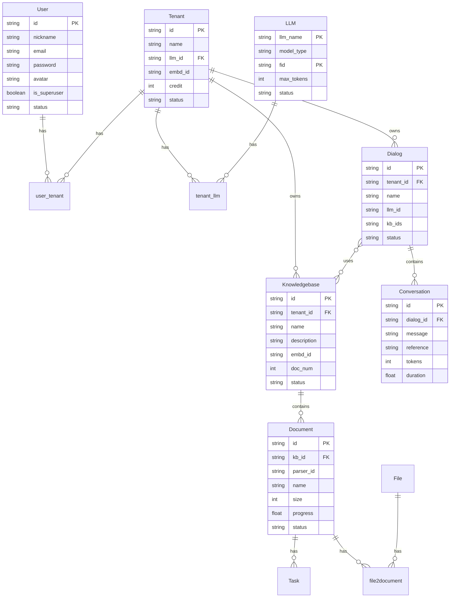
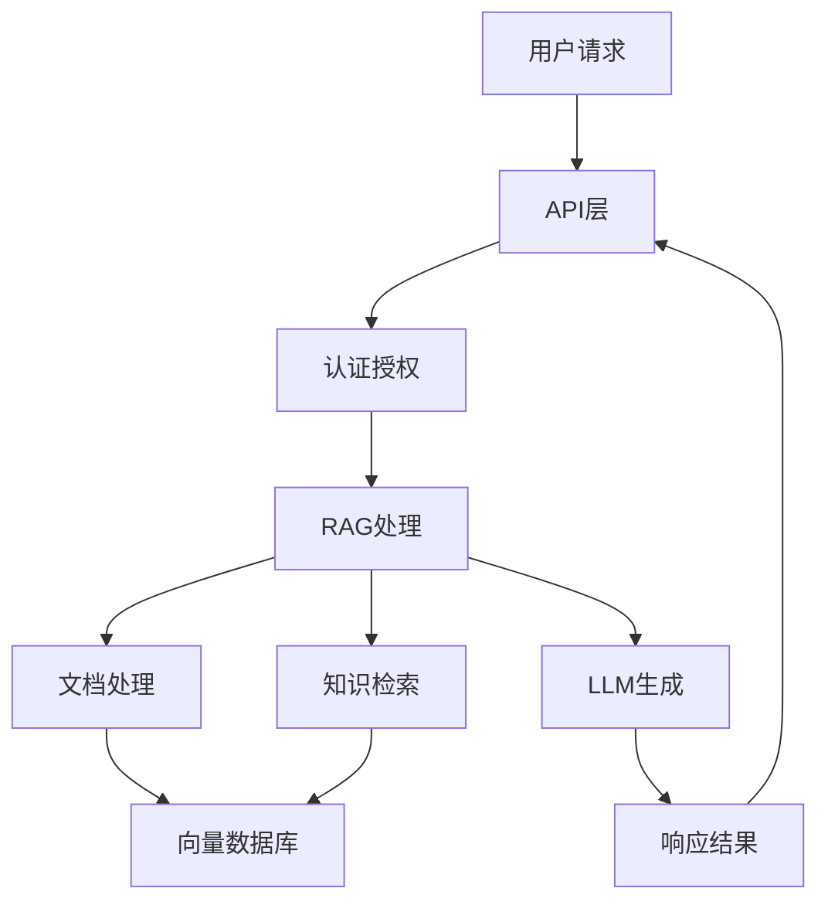
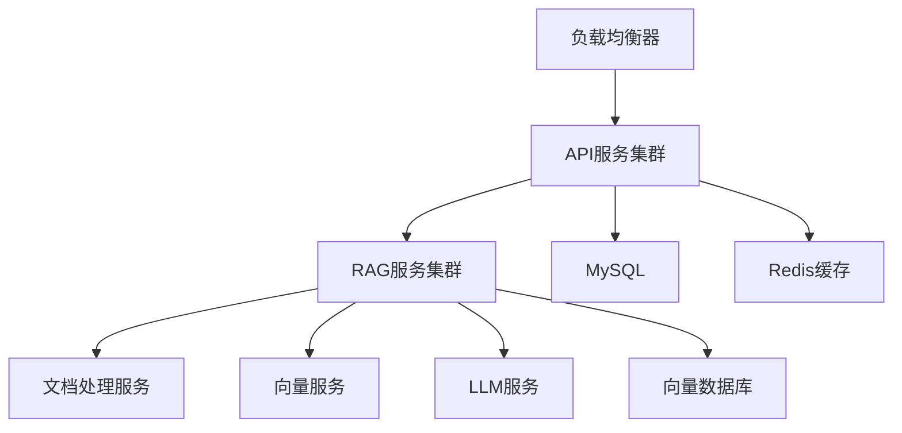

# RAGFlow 系统架构说明

## 1. 系统概述

RAGFlow 是一个基于检索增强生成(RAG)的多租户知识库问答系统。系统支持多种大语言模型(LLM)接入，提供文档处理、知识库管理、对话管理等核心功能。

## 2. 数据库设计

### 2.1 核心实体关系图



### 2.2 主要实体说明

#### 2.2.1 用户与租户管理
- User: 系统用户
- Tenant: 租户，系统的组织单位
- user_tenant: 用户-租户关联表，定义用户在租户中的角色

#### 2.2.2 知识库管理
- Knowledgebase: 知识库，属于特定租户
- Document: 文档，属于特定知识库
- File: 物理文件
- Task: 文档处理任务

#### 2.2.3 对话系统
- Dialog: 对话，可以关联多个知识库
- Conversation: 对话历史记录
- api_4_conversation: API调用的对话记录

#### 2.2.4 模型管理
- LLM: 大语言模型定义
- tenant_llm: 租户的LLM配置
- llm_factories: LLM提供商

## 3. 核心业务流程

### 3.1 用户认证流程
1. 用户注册/登录
2. 用户关联租户
3. 租户资源访问控制

### 3.2 知识库处理流程
1. 文档上传
2. 文档解析任务创建
3. 文档向量化
4. 知识库索引更新

### 3.3 对话流程
1. 创建对话
2. 关联知识库
3. 消息处理
4. 知识检索
5. LLM生成回复

## 4. 系统配置

### 4.1 LLM配置
- 支持多种LLM提供商
- 每个租户可以配置自己的LLM
- 支持模型参数自定义

### 4.2 向量化配置
- 支持多种向量化模型
- 文档分块策略
- 相似度计算配置

## 5. 性能考虑

### 5.1 数据库索引
- 所有关键字段都建立了索引
- 支持全文检索
- 时间戳索引优化

### 5.2 任务队列
- 异步文档处理
- 任务优先级管理
- 失败重试机制

## 6. 安全设计

### 6.1 多租户隔离
- 数据隔离
- 资源隔离
- 配置隔离

### 6.2 认证授权
- Token认证
- 角色权限控制
- API访问控制

## 7. 扩展性设计

### 7.1 模型扩展
- 支持新增LLM
- 支持新增向量化模型
- 支持新增文档解析器

### 7.2 业务扩展
- 支持自定义对话模板
- 支持知识库共享
- 支持多语言 

## 8. 代码结构

### 8.1 核心模块

```
ragflow/
├── api/            # API接口层
├── rag/            # RAG核心实现
├── agent/          # 智能代理实现
├── web/           # Web前端界面
├── sdk/           # SDK实现
└── docker/        # Docker部署配置
```

### 8.2 模块说明

#### 8.2.1 API模块 (api/)
- REST API接口实现
- GraphQL API接口实现
- API认证和授权
- 请求响应处理

#### 8.2.2 RAG核心模块 (rag/)
- 文档处理
- 向量化服务
- 知识检索
- LLM集成

#### 8.2.3 代理模块 (agent/)
- 智能代理实现
- 任务调度
- 对话管理
- 上下文处理

#### 8.2.4 Web前端 (web/)
- 用户界面
- 对话交互
- 知识库管理
- 系统配置

#### 8.2.5 SDK模块 (sdk/)
- Python SDK
- API客户端
- 工具集成

### 8.3 数据流



### 8.4 部署架构



## 9. 开发指南

### 9.1 环境配置
- Python 3.8+
- MySQL 8.0+
- Docker & Docker Compose
- Node.js 16+ (前端开发)

### 9.2 本地开发
1. 克隆代码库
2. 安装依赖
3. 配置环境变量
4. 启动服务

### 9.3 Docker部署
1. 构建镜像
2. 配置环境变量
3. 启动容器
4. 健康检查

## 10. API文档

### 10.1 REST API
- 用户认证 API
- 知识库管理 API
- 对话管理 API
- 文档管理 API

### 10.2 GraphQL API
- 查询接口
- 变更接口
- 订阅接口

## 11. 监控与运维

### 11.1 系统监控
- 服务健康检查
- 性能指标监控
- 资源使用监控
- 错误日志监控

### 11.2 运维工具
- 日志收集
- 指标采集
- 告警配置
- 部署工具 

## 12. 代码实现详解

### 12.1 API服务实现 (api/)

```
api/
├── apps/           # 业务应用模块
├── db/             # 数据库模型和操作
├── utils/          # 工具函数
├── settings.py     # 配置文件
├── constants.py    # 常量定义
├── validation.py   # 数据验证
└── ragflow_server.py # 服务入口
```

主要功能：
- 服务配置管理
- 请求路由处理
- 数据库操作封装
- 业务逻辑实现

### 12.2 RAG核心实现 (rag/)

```
rag/
├── app/            # 应用核心
├── llm/            # LLM集成
├── nlp/            # NLP处理
├── svr/            # 服务实现
├── utils/          # 工具函数
├── prompts.py      # 提示词模板
└── raptor.py       # RAG处理器
```

核心功能：
1. 文档处理流程
   - 文本提取
   - 文档分块
   - 向量化处理
   
2. 知识检索流程
   - 相似度计算
   - 上下文组装
   - 结果排序

3. LLM调用流程
   - 模型选择
   - 参数配置
   - 响应生成

### 12.3 数据模型关系

#### 12.3.1 用户相关模型
```python
class User:
    id: str          # 用户ID
    email: str       # 邮箱
    nickname: str    # 昵称
    password: str    # 密码
    is_superuser: bool # 是否超级用户
    status: str      # 状态

class Tenant:
    id: str          # 租户ID
    name: str        # 租户名称
    llm_id: str      # LLM配置ID
    credit: int      # 积分
    status: str      # 状态
```

#### 12.3.2 知识库相关模型
```python
class Knowledgebase:
    id: str          # 知识库ID
    tenant_id: str   # 所属租户
    name: str        # 知识库名称
    embd_id: str     # 向量模型ID
    doc_num: int     # 文档数量
    status: str      # 状态

class Document:
    id: str          # 文档ID
    kb_id: str       # 所属知识库
    name: str        # 文档名称
    parser_id: str   # 解析器ID
    progress: float  # 处理进度
    status: str      # 状态
```

#### 12.3.3 对话相关模型
```python
class Dialog:
    id: str          # 对话ID
    tenant_id: str   # 所属租户
    name: str        # 对话名称
    llm_id: str      # LLM模型ID
    kb_ids: str      # 关联知识库IDs
    status: str      # 状态

class Conversation:
    id: str          # 会话ID
    dialog_id: str   # 所属对话
    message: str     # 消息内容
    reference: str   # 引用内容
    tokens: int      # Token数量
    duration: float  # 处理时长
```

### 12.4 核心流程实现

#### 12.4.1 文档处理流程
```python
async def process_document(doc: Document):
    # 1. 文档解析
    content = await parse_document(doc)
    
    # 2. 文本分块
    chunks = await split_text(content)
    
    # 3. 向量化处理
    vectors = await vectorize(chunks)
    
    # 4. 存储索引
    await store_vectors(vectors)
```

#### 12.4.2 对话处理流程
```python
async def handle_conversation(dialog: Dialog, message: str):
    # 1. 知识检索
    context = await retrieve_knowledge(dialog.kb_ids, message)
    
    # 2. 提示词组装
    prompt = await build_prompt(context, message)
    
    # 3. LLM生成
    response = await generate_response(prompt)
    
    # 4. 保存会话
    await save_conversation(dialog.id, message, response)
```

### 12.5 API接口示例

#### 12.5.1 REST API
```python
@router.post("/api/v1/dialogs")
async def create_dialog(
    request: DialogCreate,
    current_user: User = Depends(get_current_user)
):
    """创建对话"""
    pass

@router.post("/api/v1/conversations")
async def create_conversation(
    request: ConversationCreate,
    current_user: User = Depends(get_current_user)
):
    """创建会话"""
    pass
```

#### 12.5.2 GraphQL API
```graphql
type Query {
    dialog(id: ID!): Dialog
    knowledgebase(id: ID!): Knowledgebase
}

type Mutation {
    createDialog(input: DialogInput!): Dialog
    createConversation(input: ConversationInput!): Conversation
}
```

### 12.6 配置管理

#### 12.6.1 系统配置
```python
# settings.py
class Settings:
    # 数据库配置
    DB_HOST: str
    DB_PORT: int
    DB_NAME: str
    
    # LLM配置
    LLM_API_KEY: str
    LLM_API_BASE: str
    
    # 向量服务配置
    VECTOR_HOST: str
    VECTOR_PORT: int
```

#### 12.6.2 模型配置
```python
# LLM配置
LLM_CONFIG = {
    "temperature": 0.7,
    "max_tokens": 2048,
    "top_p": 0.95
}

# 向量化配置
VECTOR_CONFIG = {
    "chunk_size": 500,
    "chunk_overlap": 50,
    "similarity_threshold": 0.7
}
``` 